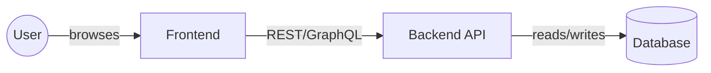

# [Project Name] — System Architecture

> Status: draft
> Last updated: YYYY-MM-DD
> Related: `.forge/project-prd.md`, `.claude/CLAUDE.md`

## Overview
<!-- One paragraph — what the system is and what problem it solves at the technical level. -->

## System Context
<!-- Who/what talks to this system? Users, external services, data sources.
     A mermaid context diagram works well here. -->

## Components
<!-- Top-level components, what each owns, which repo it lives in. -->

| Component | Responsibility | Stack | Repo |
|-----------|---------------|-------|------|
| | | | |

## Data Flow
<!-- How do requests flow through the system? Sequence diagrams help here.
     The detailed data model lives in the backend repo — link to it, do not duplicate. -->

## Deployment Topology
<!-- How is this deployed? Environments, hosting, CI/CD pipeline at a high level. -->

## Cross-Cutting Concerns
<!-- Things that span multiple components: auth, logging, error handling, observability,
     rate limiting, i18n, feature flags. -->

## Build Feasibility & High-Risk Requirements
<!-- The PRD requirements that, if they don't work, sink the engagement.
     For each: name why it's high-risk, then either a paper sketch of how it will be
     implemented OR a scoped spike if a sketch isn't enough.
     Gate 2 (/forge-arch-probe) verifies this section exists and is filled in. -->

| Requirement | Why high-risk | Paper sketch / Spike |
|-------------|---------------|----------------------|
| | | |

## In-House-First Audit
<!-- Every external dependency must be enumerated and justified vs. an in-house alternative.
     "External" = anything we don't write ourselves that shapes the architecture: managed
     services, SaaS, third-party libs that constrain the design. In-process libraries
     (logging, ORM) generally don't count unless they constrain the architecture.
     Gate 2 enforces the leadership decision to default to in-house capability. -->

| External dependency | In-house alternative considered | Rationale for external choice |
|---------------------|----------------------------------|-------------------------------|
| | | |

## Resource & Timeline Reality
<!-- Project-feasibility content. Lives here because Gate 2 verifies "can we actually
     build this?" alongside "is the architecture sound?" — both questions need answering
     before decomposition begins. Keep terse — this is a sanity check, not a project plan. -->

- **Team capacity vs. PRD scope:**
- **Skills gaps:**
- **Critical-path estimate vs. delivery window:**

## Key Technical Decisions

See `.claude/CLAUDE.md` → "Architecture Decisions (DO NOT REVERSE)" for the authoritative list. This section is a pointer, not a duplicate.

## Foundation Backlog
<!-- The enumerated list of scaffolding slices these architecture decisions imply.
     Foundation is the substrate that has to exist before per-feature work can begin —
     "anything required to run the app and write a user-story feature spec against it."
     User-visible behavior with its own flows (auth, specific data models, business flows)
     is a feature, not foundation.

     Discipline rule (tooling vs. instance):
       - Migration tooling configured = foundation. The users table migration = feature.
       - ORM base classes / repository pattern = foundation. Specific entity models = feature.
       - Design tokens + atomic components = foundation. Feature components = feature.

     Built between Gate 2 (this doc passes) and Gate 3 (decomposition). Each slice gets
     its own spec + plan under .forge/specs/foundation/ and .forge/plans/foundation/, run
     through the standard spec → plan → implementation → check pipeline. Per-step tooling
     will be introduced as patterns stabilize through real engagement experience; for now
     these steps run via direct conversation with Claude.
     See docs/methodology/framework.md §4.10 in the harness repo for the full doctrine. -->

| # | Slice | What it produces (substrate, not instances) | Repo |
|---|-------|---------------------------------------------|------|
| 1 | App shell | Framework boots, routing skeleton, env config, dev server runs | |
| 2 | Data layer scaffolding | DB connection, migration tooling configured, repository pattern (no entity migrations yet) | |
| 3 | Design system primitives | Design tokens + atomic components (Button, Input, Layout) | |
| 4 | Build & CI | Lint / typecheck / tests / build green on a hello-world commit | |
| 5 | Observability stubs | Logger, error reporter, request tracing wired into the app | |
| 6 | Developer onramp | README + "how to add a feature" guide | |

<!-- Customize per engagement: drop slices that don't apply, add slices the architecture
     specifically demands (e.g., a feature-flag system if every feature will assume one).
     If you can't name 3+ feature specs that will assume the slice exists, it's not
     foundation yet — defer it. -->

## Links to Repo-Level Design Docs
<!-- Once the code repos exist, link to their authoritative design docs here. -->

- Data model: `<backend-repo>/docs/data-model.md`
- API contracts: `<backend-repo>/docs/api/` (or OpenAPI spec path)
- Style spec: `<frontend-repo>/docs/style-spec.md`

## Open Questions
<!-- Unresolved architectural questions that need answers before or during early implementation. -->
