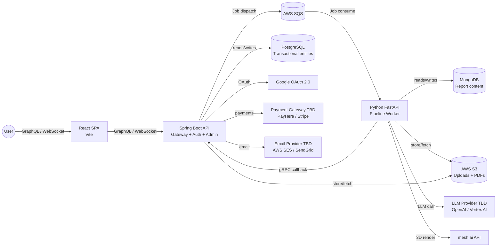

# AuctionInsightAI — System Architecture

> Status: draft
> Last updated: 2026-05-31
> Related: `.forge/project-prd.md`, `.claude/CLAUDE.md`

## Overview

AuctionInsightAI is a cloud-native SaaS platform built across three services:
a Java Spring Boot API that handles user-facing operations and job orchestration,
a Python FastAPI worker that executes the AI extraction pipeline, and a React/Vite
SPA frontend. Auction sheet uploads trigger an asynchronous pipeline job (OCR →
Translation → Extraction → Damage Interpretation → Report Generation) dispatched
via AWS SQS. Completed reports are pushed to the frontend via WebSocket. All
services are hosted on AWS.

## System Context



## Components

| Component | Responsibility | Stack | Repo |
|---|---|---|---|
| Spring Boot API | User auth, GraphQL API, credit management, job submission to SQS, WebSocket hub, admin portal endpoints, report delivery | Java 21, Spring Boot 3, Spring Security, Spring WebSocket | `<backend-repo>` |
| Python FastAPI Worker | Pipeline execution: OCR → Translation → Extraction → Damage Interpretation → Report Generation. Consumes SQS jobs, calls LLM + mesh.ai, writes to MongoDB, stores PDFs to S3, notifies Spring Boot via gRPC | Python 3.11, FastAPI, PaddleOCR, gRPC | `<worker-repo>` |
| React SPA | User-facing web application: upload, report viewer, analysis history, credit management, mobile-responsive | React 18, Vite, GraphQL client | `<frontend-repo>` |
| PostgreSQL | Transactional data store for User, Analysis, PipelineStep, Credit, CreditTransaction, CreditDisputeRequest | PostgreSQL 15 | Managed via Spring Boot |
| MongoDB | Report content store — structured JSON output per Analysis (schema-flexible, potentially large) | MongoDB 7 | Managed via Python worker |
| AWS S3 | Durable object store for original uploaded sheets and generated report PDFs | AWS S3 + SSE-AES256 | Both services |
| AWS SQS | Async job queue — Spring Boot produces Analysis jobs, FastAPI worker consumes them | AWS SQS Standard | Infrastructure |

## Data Flow

### Happy path — Analysis pipeline

```mermaid
sequenceDiagram
  participant U as User (SPA)
  participant API as Spring Boot API
  participant SQS as AWS SQS
  participant W as FastAPI Worker
  participant LLM as LLM Provider
  participant M as mesh.ai
  participant S3 as AWS S3
  participant Mongo as MongoDB

  U->>API: Upload auction sheet (GraphQL mutation)
  API->>S3: Store original file (AES-256)
  API->>API: Deduct 1 credit; create Analysis (uploaded)
  API->>SQS: Enqueue analysis job (analysis_id)
  API-->>U: Job accepted (analysis_id, WebSocket channel)

  SQS->>W: Consume job
  W->>S3: Fetch uploaded sheet
  W->>W: OCR (PaddleOCR) — PipelineStep recorded
  W->>LLM: Translate + extract fields — PipelineStep recorded
  W->>W: Damage code interpretation — PipelineStep recorded
  W->>M: Request 3D render with damage markers — PipelineStep recorded
  M-->>W: 3D render asset
  W->>Mongo: Write Report JSON
  W->>S3: Write Report PDF
  W->>API: gRPC: pipeline complete (analysis_id, report_id)
  API-->>U: WebSocket push: report ready

  U->>API: View / download report (GraphQL query)
```

### Fallback — pipeline exceeds real-time window or fails

If the pipeline takes longer than the WebSocket session allows, or fails,
the user receives an email notification via the email provider when the
pipeline completes (or with failure details and a link to submit a
CreditDisputeRequest).

## Deployment Topology

All services deployed on AWS. Region TBD (confirmed at infrastructure setup).

| Service | Hosting | Notes |
|---|---|---|
| Spring Boot API | AWS ECS (Fargate) | Stateless; horizontally scalable |
| Python FastAPI Worker | AWS ECS (Fargate) | Worker pool; scales with SQS queue depth |
| PostgreSQL | AWS RDS PostgreSQL | Managed; automated backups |
| MongoDB | AWS DocumentDB or MongoDB Atlas | TBD at infrastructure setup |
| AWS S3 | AWS S3 | SSE-AES256; versioning enabled |
| AWS SQS | AWS SQS Standard | Dead-letter queue configured |
| React SPA | AWS CloudFront + S3 | Static build; CDN distribution |
| CI/CD | GitHub Actions | Build → test → deploy pipeline |

## Cross-Cutting Concerns

### Authentication and Authorisation

Spring Boot handles auth directly — no managed auth provider. Users authenticate
via email/password or Google OAuth 2.0 (Spring Security OAuth2 client). Spring Boot
issues JWT tokens signed RS256 with claims: `user_id`, `role`
(`individual_user` / `support_admin` / `technical_admin` / `super_admin`),
`tenant_id` (null Phase 1). RBAC enforced via Spring Security method-level
annotations. 24-hour access token, 30-day refresh token.

### Inter-Service Communication

- **Frontend → Spring Boot:** GraphQL over HTTPS (Apollo or similar)
- **Spring Boot → FastAPI worker:** AWS SQS (async job dispatch)
- **Spring Boot ↔ FastAPI:** gRPC (direct calls — admin pipeline intervention,
  step completion callbacks, status queries)
- **Spring Boot → Frontend:** WebSocket (real-time pipeline completion push)

### Error Handling and Retries

SQS dead-letter queue captures jobs that fail after N retries (N TBD at
infrastructure setup). PipelineStep records capture per-step failure state and
error detail. Technical Admin and Super Admin can inspect failures and trigger
pipeline resume via gRPC.

### Observability

Structured JSON logging in both Spring Boot and FastAPI. AWS CloudWatch for log
aggregation. Request tracing via correlation IDs propagated from API through SQS
job payload to worker. PipelineStep timing metrics surfaced to Technical Admin.

### Rate Limiting

Login attempts: 5 per 10 minutes per IP (Spring Security). API rate limiting on
upload endpoint to prevent credit abuse (specific limits TBD).

## Build Feasibility & High-Risk Requirements

| Requirement | Why high-risk | Paper sketch / Spike |
|---|---|---|
| Sub-30s end-to-end pipeline latency | Pipeline makes 3 external calls (LLM, mesh.ai, report assembly) with cumulative latency unknown. Target is aspirational — not validated. | **Spike SP-ARCH-001:** Benchmark LLM translation (< 8s target) and mesh.ai render latency on a real USS sheet. Run OCR benchmark with PaddleOCR. Measure total before committing to SLA. Fallback: email notification when pipeline completes if real-time delivery window has expired. |
| mesh.ai 3D render integration | API confirmed to exist (meshy.ai, premium subscription required). Capability to accept arbitrary damage location/type inputs and return vehicle-specific renders is unvalidated. | **Spike SP-ARCH-002:** Authenticate with mesh.ai API, send sample damage markers from a real USS sheet, validate render output quality and latency. Confirm pricing model fits the per-analysis cost structure. |
| PaddleOCR accuracy on auction sheets | Auction sheets have dense Japanese text, handwritten annotations, and skewed damage diagrams. CER target < 8% on standard sheets needs validation. | Paper sketch: pre-processing pipeline (auto-deskew ±15°, binarisation, contrast enhancement) before OCR. Validate on 10+ real USS sheet samples during prototype. |
| gRPC between Java and Python | Spring Boot (Java) ↔ FastAPI (Python) gRPC requires shared proto definitions and compatible generated clients. | Paper sketch: define `.proto` for PipelineCallback and PipelineIntervention services; generate Java (grpc-java) and Python (grpcio) stubs; validate in hello-world spike (F-007) before feature work begins. |

## In-House-First Audit

| External dependency | In-house alternative considered | Rationale for external choice |
|---|---|---|
| LLM Provider (TBD — OpenAI GPT-4o / Google Vertex AI) | Fine-tune a domain-specific translation model | Building from scratch not viable in the prototype timeline; domain accuracy and Japanese language capability require a large pre-trained model |
| PaddleOCR | Write custom OCR | Mature open-source OCR with Japanese support; no build justification |
| mesh.ai | Build 3D vehicle renderer | Specialist 3D rendering capability; not buildable in-house in any reasonable timeline |
| AWS S3 | Self-hosted file storage (MinIO, etc.) | Managed reliability, SSE, CDN, IAM integration; standard production choice |
| Google OAuth 2.0 | Email/password only | Reduces registration friction; user expectation for modern SaaS |
| Payment Gateway (TBD — PayHere / Stripe) | Build payment processing | PCI compliance prohibits in-house card processing; standard industry practice |
| Email Provider (TBD — AWS SES / SendGrid) | Self-hosted SMTP | Deliverability and reputation management require managed service |

## Resource & Timeline Reality

- **Team capacity vs. PRD scope:** Small team (2–3 developers). Phase 1 prototype
  target is 3 weeks. Full Phase 1 scope (auth, upload, 5-stage pipeline, 3D render,
  report generation, billing, admin portal) is ambitious for 3 weeks. Prototype
  milestone should scope admin portal and full billing to basic stubs; core pipeline
  (upload → report) is the critical-path deliverable.
- **Skills gaps:** None identified. Team has prior experience across Java Spring Boot,
  Python, React/Vite, AWS, and AI/ML pipelines.
- **Critical-path estimate:** OCR + LLM + mesh.ai pipeline integration is the longest
  lead-time item. Spikes SP-ARCH-001 and SP-ARCH-002 should run in Week 1 in parallel
  with foundation scaffolding to de-risk before feature implementation begins.

## Key Technical Decisions

See `.claude/CLAUDE.md` → "Architecture Decisions (DO NOT REVERSE)" for the
authoritative list. This section is a pointer, not a duplicate.

The decisions table includes a **Reversible?** column that classifies each decision
as:
- ❌ **Hard** — deeply embedded across services or data; reversal requires
  significant rework (async pipeline, service boundary split)
- ⚠️ **Costly** — reversible but expensive in migration effort (dual-DB, GraphQL
  contract)
- ✅ **Moderate / Low** — reversible at a service boundary or session boundary with
  contained effort (auth provider, gRPC, WebSocket, SPA/SSR)

## Foundation Backlog

| # | Slice | What it produces (substrate, not instances) | Repo |
|---|---|---|---|
| F-001 | App shell — Spring Boot | Spring Boot boots with env config, health endpoint, dev server runs | `<backend-repo>` |
| F-002 | App shell — FastAPI worker | FastAPI worker boots, connects to SQS, processes a hello-world job end-to-end | `<worker-repo>` |
| F-003 | App shell — React SPA | Vite + React boots, routing skeleton, GraphQL client wired, dev server runs | `<frontend-repo>` |
| F-004 | Data layer — PostgreSQL | RDS connection, Flyway migration tooling configured, repository base classes (no entity migrations yet) | `<backend-repo>` |
| F-005 | Data layer — MongoDB | MongoDB connection, repository base class for Report documents | `<worker-repo>` |
| F-006 | Message queue wiring | SQS producer in Spring Boot + SQS consumer in FastAPI; hello-world job round-trip passes | Both |
| F-007 | gRPC channel | Shared `.proto` definitions, generated Java + Python stubs, hello-world gRPC call Spring Boot ↔ FastAPI passes | Both |
| F-008 | Auth scaffolding | JWT RS256 issue/validate, Google OAuth 2.0 flow, RBAC annotations wired (no user-story flows yet) | `<backend-repo>` |
| F-009 | WebSocket hub | Spring Boot WebSocket configured; client connects and receives a test push event | Both |
| F-010 | S3 wiring | Upload and download via AWS SDK confirmed working | Both |
| F-011 | Design system primitives | Design tokens, atomic components (Button, Input, Card, Layout) | `<frontend-repo>` |
| F-012 | Build & CI | Lint / typecheck / tests / build green on hello-world commit for all three repos | All |
| F-013 | Observability stubs | Structured JSON logger, correlation ID propagation, error reporter wired in all services | All |

## Links to Repo-Level Design Docs

- Data model: `<backend-repo>/docs/data-model.md`
- API contracts: `<backend-repo>/docs/api/`
- Style spec: `<frontend-repo>/docs/style-spec.md`

## Open Questions

- MongoDB hosting: AWS DocumentDB vs. MongoDB Atlas — decide at infrastructure setup
- SQS dead-letter queue retry count (N) — decide at infrastructure setup
- AWS region selection — decide at infrastructure setup
- Email provider selection (AWS SES vs. SendGrid) — decide before first notification feature
