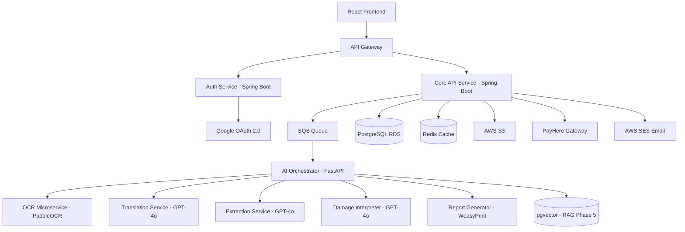

# Software Requirements Specification
# Auction Insight AI — AI-Powered Japanese Vehicle Auction Sheet Analysis Platform

**Document Version:** 1.0.0  
**Status:** Draft for Review  
**Prepared By:** Solution Architecture Team  
**Primary Market:** Sri Lanka (LKR) — extensible to global markets  
**Date:** May 2026  
**Classification:** Confidential — Investor & Engineering Use

---

## Table of Contents

1. Executive Summary  
2. Business Problem  
3. Product Vision  
4. User Personas  
5. Functional Requirements  
6. Non-Functional Requirements  
7. System Architecture  
8. AI Pipeline Architecture  
9. OCR Pipeline Design  
10. Translation Pipeline  
11. Prompt Engineering Strategy  
12. RAG Architecture  
13. Database Design  
14. API Specifications  
15. Authentication & Authorization  
16. Payment Flow  
17. SaaS Multi-Tenant Design  
18. Frontend Module Design  
19. Backend Microservices  
20. AI Confidence Scoring  
21. Error Handling Strategy  
22. Security Architecture  
23. Compliance Considerations  
24. Scalability Strategy  
25. DevOps & CI/CD  
26. Logging & Monitoring  
27. Testing Strategy  
28. Deployment Architecture  
29. Cost Optimization Strategy  
30. Third-Party Service Evaluation  
31. 3D Rendering Strategy  
32. Vehicle Damage Mapping Logic  
33. Export & Reporting Module  
34. Admin Portal  
35. User Flows  
36. Sequence Diagrams  
37. Future Enhancements  
38. Risk Analysis  
39. Technical Constraints  
40. Estimated Development Roadmap

---

## 1. Executive Summary

Auction Insight AI is a cloud-native, AI-powered Software-as-a-Service (SaaS) platform that transforms raw Japanese vehicle auction sheets into structured, actionable vehicle intelligence reports. The platform targets vehicle importers, car dealers, auction agents, and individual buyers operating in right-hand-drive import markets, with Sri Lanka as the primary launch market and a roadmap toward multi-region expansion.

Japanese auction houses — including USS, JAA, JU, TAA, and regional networks — issue standardised condition sheets written almost entirely in Japanese. These sheets encode vehicle grade, mileage, chassis number, equipment, damage notation, inspection comments, and repair history using a proprietary grading vocabulary and pictographic damage diagrams. Currently, importers rely on human translators, bilingual agents, or partial machine-translation services that miss domain-specific damage codes, producing unreliable assessments and significant financial risk.

Auction Insight AI solves this problem end-to-end: a user uploads a PDF or image of an auction sheet; the platform runs a multi-stage AI pipeline (OCR → translation → structured extraction → damage interpretation → report generation) and delivers a human-readable, professionally formatted vehicle intelligence report within seconds. Downstream, the platform supports interactive 2D/3D damage visualisation, multi-sheet comparison, risk scoring, and white-label dealer integrations.

**Platform Highlights:**

- Sub-30-second end-to-end analysis latency (Phase 1 target)
- Support for all major Japanese auction sheet formats (USS, JAA, JU, TAA)
- Pay-per-analysis and subscription billing models (LKR and USD)
- Multi-tenant architecture enabling white-label dealer portals
- Phased delivery over five release increments spanning 18 months
- Built on AWS, Java Spring Boot, Python FastAPI microservices, and React/Three.js frontend

**Business Model:** Pay-per-analysis (LKR 150–500 per report), monthly dealer subscriptions (LKR 5,000–25,000), and white-label SaaS licensing for dealer networks.

---

## 2. Business Problem

### 2.1 Market Context

Sri Lanka imports approximately 40,000–60,000 used vehicles annually, the majority sourced from Japanese auction houses. The import chain involves auction agents in Japan who bid on behalf of Sri Lankan buyers, shipping agents, customs brokers, and domestic dealers. The condition and price of a vehicle are directly correlated to the information encoded on its auction sheet.

### 2.2 Core Pain Points

**Language Barrier:** Auction sheets are printed almost entirely in Japanese — grading comments, damage descriptions, inspection remarks, and special notes are inaccessible to the majority of Sri Lankan importers without a Japanese-speaking intermediary.

**Grading Misinterpretation:** Japanese auction houses use proprietary grading systems (e.g., Grade 6, 5, 4.5, 4, 3.5, 3, 2, 1, RA, R) and damage codes (e.g., E1, E2, W1, W2, A1, U) that are not intuitive. A grade 3.5 vehicle with W2 (windscreen replacement) and U1 (undercarriage rust) represents a materially different risk profile from a 3.5 with cosmetic scratches only.

**Damage Visualisation Gap:** Auction sheets contain 2D top-down/side-view vehicle diagrams with handwritten damage notation markers. Currently, these are assessed by eye with no digital overlay, quantification, or comparative history.

**Slow Turnaround:** Manual translation and assessment takes 2–24 hours depending on agent availability. In live auction environments (USS holds 3–4 auctions per week), buyers must decide within minutes, making slow turnaround commercially unacceptable.

**No Historical Intelligence:** Importers have no structured database of past analyses, making it impossible to track patterns, benchmark auction grades against real condition, or assess agents' accuracy over time.

**Fraud Risk:** Odometer tampering, chassis number misrepresentation, and accident concealment are documented risks in Japanese used vehicle exports. A structured AI analysis creates a timestamped, auditable record that can flag inconsistencies.

### 2.3 Opportunity

No incumbent SaaS platform in Sri Lanka addresses this problem end-to-end. Existing partial solutions include: generic OCR tools (no domain understanding), Google Translate (misses auction vocabulary), manual bilingual agents (slow, expensive, inconsistent), and Japanese-language auction portals (accessible only to registered agents with Japanese literacy).

Auction Insight AI creates a category-defining product with a defensible moat: proprietary training data, a curated Japanese automotive domain vocabulary, and network-effect advantages from historical report accumulation.

---

## 3. Product Vision

### 3.1 Vision Statement

*"To be the intelligence layer between every Japanese auction sheet and every import decision — globally."*

### 3.2 Product Principles

1. **Speed over perfection in Phase 1** — A fast, good report beats a slow, perfect one in an auction environment.
2. **Transparency of AI confidence** — Every extracted field carries a confidence score; ambiguity is surfaced, not hidden.
3. **Domain depth over general AI** — The platform trains on auction-specific vocabulary, not generic NLP models.
4. **Dealer-first distribution** — White-label dealer portals are the primary growth vector, not direct consumer acquisition.
5. **Data as a moat** — Every analysis enriches the knowledge base, compounding accuracy and defensibility over time.

### 3.3 Success Metrics (12-Month Targets)

| Metric | Target |
|---|---|
| Analyses processed per month | 3,000+ |
| Report generation latency (p95) | < 35 seconds |
| Field extraction accuracy | > 92% |
| Paying dealer tenants | 20+ |
| Monthly Recurring Revenue | LKR 500,000+ |
| User satisfaction (CSAT) | > 4.2 / 5.0 |
| Uptime SLA | 99.5% |

---

## 4. User Personas

### 4.1 Persona A — The Independent Importer (Primary)

**Name:** Pradeep, 38, Colombo  
**Role:** Independent vehicle importer; buys 5–15 vehicles per month from Japanese auctions via an agent in Osaka.  
**Pain:** Relies entirely on his agent's WhatsApp summaries of auction sheets. Has been deceived twice about vehicle condition, resulting in LKR 400,000+ in repairs.  
**Needs:** Self-serve access to full auction sheet analysis in English, fast enough to make a bid decision. Wants to see damage clearly visualised.  
**Tech literacy:** Moderate — comfortable with web apps.  
**Willingness to pay:** LKR 200–300 per analysis; prefers pay-as-you-go.

### 4.2 Persona B — The Car Dealer (High Value)

**Name:** Sanjeewa, 45, runs a 3-franchise dealership in Negombo  
**Role:** Purchases 30–50 vehicles per month; employs 2 sales staff who assess auction sheets.  
**Pain:** Inconsistent assessment quality across staff; no audit trail; loses bids due to slow analysis.  
**Needs:** Team access with shared dashboard; bulk upload; branded reports for customers.  
**Willingness to pay:** LKR 15,000–20,000/month subscription.

### 4.3 Persona C — The Auction Agent (Enabler)

**Name:** Kenji (Japan-based), 34  
**Role:** Japanese auction agent who bids on behalf of 20+ Sri Lankan clients.  
**Pain:** Spends 3–4 hours daily translating and summarising sheets via email/WhatsApp.  
**Needs:** API access to generate reports programmatically; white-label reports under his own brand.  
**Willingness to pay:** API subscription LKR 25,000+/month.

### 4.4 Persona D — The Platform Admin

**Name:** Internal Auction Insight AI operations staff  
**Role:** Monitors system health, reviews low-confidence extractions, manages tenant billing, handles escalations.  
**Needs:** Full admin portal with queue management, confidence review workflows, billing oversight, audit logs.

### 4.5 Persona E — The Individual Buyer (Future)

**Name:** Chamara, 28, first-time buyer  
**Role:** Purchasing a single vehicle; found auction sheet shared by dealer.  
**Needs:** Simple, clear report in plain language; mobile-friendly.  
**Willingness to pay:** LKR 150 one-time.

---
## 5. Functional Requirements

### 5.1 Phase 1 — Core Analysis Engine

#### FR-001: User Registration & Authentication

- The system SHALL support user registration via email/password and Google OAuth 2.0.
- The system SHALL enforce email verification before first analysis.
- The system SHALL support password reset via email OTP.
- JWT tokens signed RS256; include tenant_id, user_id, role claims; 24-hour expiry with 30-day refresh token.

**Acceptance Criteria:** Google OAuth login completes in under 3 seconds. Failed login attempts rate-limited to 5 per 10 minutes per IP.

#### FR-002: Auction Sheet Upload

- The system SHALL accept PDF (single and multi-page) and image files (JPEG, PNG, WEBP, HEIC) up to 20 MB.
- The system SHALL validate file type via MIME sniffing (not extension only).
- The system SHALL store original files in AWS S3 with server-side AES-256 encryption.
- The system SHALL display thumbnail preview and upload progress indicator.
- The system SHALL allow re-upload of a failed or poor-quality sheet.

**Acceptance Criteria:** Upload of a 5 MB JPEG completes in under 5 seconds on a 10 Mbps connection. Unsupported file types return HTTP 422 with descriptive error.

#### FR-003: OCR Extraction

- The system SHALL apply PaddleOCR to extract all Japanese and numeric text from uploaded sheets.
- The system SHALL handle rotated and skewed images via pre-processing (auto-deskew up to ±15°).
- The system SHALL return bounding box coordinates for each detected text element.
- The system SHALL assign a per-field OCR confidence score (0.0–1.0).
- The system SHALL flag fields with confidence below 0.75 for human review.

**Acceptance Criteria:** OCR extraction completes in under 10 seconds. Character Error Rate (CER) below 8% on standard quality sheets.

#### FR-004: Japanese-to-English Translation

- The system SHALL translate extracted Japanese text using OpenAI GPT-4o with domain-specific system prompts.
- The system SHALL maintain a custom glossary of 500+ auction-domain terms.
- The system SHALL preserve untranslated field labels alongside translations.
- The system SHALL flag ambiguous translations with an alternative interpretation.

**Acceptance Criteria:** Translation of a full auction sheet completes in under 8 seconds. Domain-specific terms are translated using the canonical glossary.

#### FR-005: Structured Data Extraction

The system SHALL extract and map the following canonical fields from every sheet:

| Field Group | Fields |
|---|---|
| Identity | Lot number, chassis/VIN, model code, model name |
| Dates | Registration date, manufacture date, inspection date |
| Specifications | Displacement (cc), transmission, drive type, doors, fuel type, seat capacity |
| Condition | Overall auction grade, interior grade, mileage |
| Appearance | Original colour code, changed colour (if applicable) |
| Dimensions | Length x Width x Height (cm) |
| Assessment | Good selling points, bad points, comments, inspector notes |

#### FR-006: Damage Notation Interpretation

The system SHALL parse all standard auction damage codes:

**Location Codes:** A1 = front bumper, A2 = bonnet, A3 = roof, A4 = boot lid, A5 = rear bumper, B1-B4 = left/right front/rear doors, C1-C4 = fenders/pillars, D = interior, E = engine bay, F = floor/undercarriage.

**Damage Type Codes:** S = Scratch, D = Dent, W = Wave/distortion, C = Crack, X = Repair needed, XX = Severe/replacement required, U = Rust/corrosion, E = Already exchanged/replaced, P = Paint work, B = Broken.

**Severity Modifiers:** 1 = Small/minor, 2 = Medium, 3 = Large/severe.

**Acceptance Criteria:** All standard USS codes correctly interpreted with over 95% accuracy. Damage manifest returned as structured JSON alongside free-text description.

#### FR-007: Payment Gateway Integration

- Integration with PayHere (Sri Lanka) as primary gateway; Stripe as fallback for international payments.
- Pay-per-analysis (LKR 250 standard, LKR 500 priority); monthly subscription plans.
- PDF receipt/invoice for every transaction.
- Idempotency keys prevent double-charging.
- Payment history accessible per user.

**Acceptance Criteria:** PayHere payment flow completes in under 30 seconds. Payment confirmation triggers instant credit allocation.

#### FR-008: Analysis Dashboard

- Dashboard panels: Vehicle Overview, Condition & Grading, Damage Detail, Inspector Comments, Raw Extracted Text.
- Status indicators: Processing / Complete / Failed / Under Review.
- Quick-access filters: date range, vehicle model, grade, status.

#### FR-009: Report Generation

- Branded PDF report generated in under 5 seconds post-analysis.
- Report includes: vehicle overview, specification table, grading explanation, damage summary with colour-coding, translated comments, AI confidence indicators, disclaimer.
- Reports stored for 90 days.

#### FR-010: Admin Portal (Phase 1)

- User management, analysis queue, low-confidence review workflow, billing overview, system health dashboard, audit log, glossary management.
- Admin role accessible only to ROLE=ADMIN users.

### 5.2 Phase 2 — Visual Damage Mapping

#### FR-011: 2D Damage Diagram Overlay

- Render 2D vehicle schematic (top and side views) with colour-coded damage markers overlaid from the extracted damage manifest.
- Colour scheme: green = minor, yellow = moderate, orange = significant, red = severe.
- Users may hover or click markers to reveal damage detail popover.

#### FR-012: 3D Damage Visualisation

- Three.js-rendered 3D vehicle model with damage zone highlights.
- Vehicle type detection (sedan/hatchback/SUV/van/truck/coupe) from model data selects matching 3D asset.
- Full rotate, zoom, and pan interaction supported.

### 5.3 Phase 3 — Intelligence & Export

#### FR-013: Multi-Sheet Comparison

Side-by-side comparison of up to 4 analyses with highlighted differences in grade, mileage, damage, and price signals.

#### FR-014: AI Risk Summary

Plain-language risk classification (Low Risk / Moderate Risk / High Risk / Do Not Buy) with explainable contributing factors.

#### FR-015: Export Module

PDF export of full branded report; Excel (.xlsx) export of structured data; CSV export of damage manifest.

#### FR-016: Historical Tracking

Searchable history of all user analyses with tags, annotations, and archive capability.

### 5.4 Phase 4 — Multi-Tenant & Dealer Platform

#### FR-017: Multi-Tenant Architecture

Isolated tenant workspaces with tenant-scoped data; configurable branding (logo, colours, domain); tenant admins manage their own users, billing, and report templates.

#### FR-018: White-Label Dealer Portal

Branded subdomains (e.g., dealer-name.auctioninsight.lk); all user-facing pages reflect dealer branding; public report share links.

#### FR-019: Public API

REST API with API key authentication. Endpoints: upload sheet, get analysis status, retrieve structured result, download report. Rate limits: 100 requests/hour (standard), 500 requests/hour (enterprise).

### 5.5 Phase 5 — AI Intelligence Layer

#### FR-020: RAG Pipeline — Retrieval-Augmented Generation over historical analyses; semantic search across past reports.

#### FR-021: AI Chat Assistant — Natural language questions over any analysis or vehicle history.

#### FR-022: Risk Scoring Engine — Quantitative risk score (0–100) incorporating grade, mileage, damage severity, age, and model reliability data.

#### FR-023: Predictive Analytics — Price guidance based on historical patterns; aggregated damage trend analysis across tenants (anonymised).

---
## 6. Non-Functional Requirements

### 6.1 Performance

| Requirement | Target |
|---|---|
| End-to-end analysis (upload to report) p50 | < 20 seconds |
| End-to-end analysis p95 | < 35 seconds |
| API response (status check) | < 300 ms |
| Dashboard page load (initial) | < 2.5 seconds |
| Report PDF generation | < 5 seconds |
| Concurrent analyses supported (Phase 1) | 50 |
| Concurrent analyses supported (Phase 4) | 500 |

### 6.2 Availability & Reliability

- Phase 1 SLA: 99.5% monthly uptime; Phase 4: 99.9%
- Planned maintenance windows: Sundays 00:00–02:00 LKT
- RTO (Recovery Time Objective): 4 hours; RPO (Recovery Point Objective): 1 hour
- All AI pipeline steps idempotent and retryable (max 3 retries, exponential back-off)
- Failed analyses trigger user notification within 5 minutes

### 6.3 Security

- All data encrypted at rest (AES-256) and in transit (TLS 1.3)
- OWASP Top 10 compliance enforced; annual penetration test
- PII handled per Sri Lanka Personal Data Protection Act (PDPA) 2022
- Uploaded auction sheets scoped to uploading user/tenant; never shared cross-tenant

### 6.4 Usability

- WCAG 2.1 AA accessibility compliance for all user-facing interfaces
- Mobile-responsive design operable on 375px viewport
- First-time user can complete an analysis without documentation in under 5 minutes
- No raw stack traces or internal error details exposed to users

### 6.5 Internationalisation

- Phase 1: English UI, Japanese source text processing
- Phase 2: Sinhala UI option
- Currency: LKR default; USD toggle for international users
- Date format: DD/MM/YYYY (Sri Lanka standard)
- All monetary amounts formatted to 2 decimal places with currency symbol

---

## 7. System Architecture

### 7.1 High-Level Architecture

```
                    ┌─────────────────────────────────────┐
                    │           CLIENT TIER                │
                    │  React SPA + Dealer White-Label SPAs │
                    └──────────────┬──────────────────────┘
                                   │ HTTPS
                    ┌──────────────▼──────────────────────┐
                    │   AWS CloudFront + WAF               │
                    └──────────────┬──────────────────────┘
                                   │
                    ┌──────────────▼──────────────────────┐
                    │   AWS API Gateway (Rate Limiting)    │
                    └──────┬────────────────┬─────────────┘
                           │                │
           ┌───────────────▼──┐   ┌─────────▼──────────────┐
           │  Auth Service    │   │  Core API Service       │
           │  Spring Boot     │   │  Spring Boot            │
           │  JWT / OAuth 2.0 │   │  Upload/User/Billing    │
           └──────────────────┘   └──────────┬──────────────┘
                                             │ SQS
                         ┌───────────────────▼──────────────────┐
                         │   AI Orchestration Service           │
                         │   Python FastAPI                     │
                         │  ┌────────┬──────┬────────┬────────┐ │
                         │  │  OCR   │Trans │Extract │Report  │ │
                         │  │Paddle  │GPT4o │  GPT4o │  Gen   │ │
                         │  └────────┴──────┴────────┴────────┘ │
                         └───────────────┬──────────────────────┘
                                         │
         ┌───────────────────────────────┼─────────────────────┐
         │                               │                     │
┌────────▼───────┐             ┌─────────▼──────┐   ┌─────────▼──┐
│  PostgreSQL    │             │  Redis Cache   │   │  AWS S3    │
│  RDS Multi-AZ  │             │  ElastiCache   │   │  Encrypted │
└────────────────┘             └────────────────┘   └────────────┘
```

### 7.2 Microservice Decomposition



### 7.3 Communication Patterns

| Service Pair | Protocol | Pattern |
|---|---|---|
| Frontend to API Gateway | HTTPS REST | Request/Response |
| Core API to AI Orchestrator | AWS SQS | Async queue dispatch |
| AI Orchestrator to Client | WebSocket | Real-time status push |
| AI pipeline internal stages | HTTP REST | Chained sequential calls |
| Services to PostgreSQL | TCP/5432 | HikariCP connection pool |
| Services to Redis | TCP/6379 | Cache-aside pattern |

---

## 8. AI Pipeline Architecture

### 8.1 Pipeline Stages

```
[File Upload to S3]
      |
[Image Pre-processing]  ← deskew, enhance contrast, denoise, sharpen
      |
[PaddleOCR Extraction]  ← Japanese + numeric text with bounding boxes
      |
[Region Classification] ← header / specs / grade / damage diagram / comments
      |
[Glossary Lookup]       ← deterministic term mapping (fast path)
      |
[GPT-4o Translation]    ← LLM for unmapped terms and free text
      |
[GPT-4o Structured Extraction] ← canonical JSON schema population
      |
[Damage Code Parser]    ← USS/JAA/JU code vocabulary interpretation
      |
[Confidence Scorer]     ← composite per-field confidence calculation
      |
[Report Assembly]       ← Jinja2 HTML template rendering
      |
[PDF Generation]        ← WeasyPrint CSS-styled PDF
      |
[S3 Storage + DB Update]
      |
[WebSocket Notification] ← push completion to client
```

### 8.2 LangChain Orchestration Skeleton

```python
from langchain.chains import SequentialChain
from langchain_openai import ChatOpenAI

llm = ChatOpenAI(model="gpt-4o", temperature=0)

pipeline = SequentialChain(
    chains=[
        TranslationChain(llm=llm, glossary=load_glossary()),
        ExtractionChain(llm=llm, output_schema=AuctionSheetSchema),
        DamageInterpretationChain(llm=llm, code_table=load_damage_codes()),
    ],
    input_variables=["raw_ocr_text", "bounding_boxes"],
    output_variables=["structured_data", "damage_manifest", "confidence_scores"]
)
```

### 8.3 Error Handling in Pipeline

Each stage wraps execution in try/except with structured error logging. On stage failure, the orchestrator retries up to 3 times with exponential back-off. After 3 failures, the analysis is marked `failed` and the user is notified. Partial results from successful stages are preserved in the database for debugging and potential manual recovery.

---

## 9. OCR Pipeline Design

### 9.1 Pre-processing Algorithm

```python
import cv2
import numpy as np
from paddleocr import PaddleOCR

def preprocess_auction_sheet(image_path: str) -> np.ndarray:
    img = cv2.imread(image_path)
    gray = cv2.cvtColor(img, cv2.COLOR_BGR2GRAY)

    # Detect and correct skew
    coords = np.column_stack(np.where(gray > 0))
    angle = cv2.minAreaRect(coords)[-1]
    if angle < -45:
        angle = -(90 + angle)
    else:
        angle = -angle
    (h, w) = gray.shape
    M = cv2.getRotationMatrix2D((w // 2, h // 2), angle, 1.0)
    gray = cv2.warpAffine(gray, M, (w, h), flags=cv2.INTER_CUBIC)

    # Adaptive threshold for uneven lighting
    thresh = cv2.adaptiveThreshold(
        gray, 255, cv2.ADAPTIVE_THRESH_GAUSSIAN_C,
        cv2.THRESH_BINARY, 11, 2
    )

    # Denoise and sharpen
    denoised = cv2.fastNlMeansDenoising(thresh, h=10)
    kernel = np.array([[0, -1, 0], [-1, 5, -1], [0, -1, 0]])
    return cv2.filter2D(denoised, -1, kernel)

def run_ocr(image: np.ndarray) -> list:
    ocr = PaddleOCR(use_angle_cls=True, lang='japan', use_gpu=False)
    result = ocr.ocr(image, cls=True)
    return [
        {
            "text": line[1][0],
            "confidence": line[1][1],
            "bbox": line[0]
        }
        for page in result for line in page
    ]
```

### 9.2 OCR Extraction Example

**Raw OCR Output (sample — Nissan Skyline ECR32 sheet):**

```json
[
  { "text": "\u30b9\u30ab\u30a4\u30e9\u30a4\u30f3", "confidence": 0.97 },
  { "text": "ECR32", "confidence": 0.99 },
  { "text": "25GTS", "confidence": 0.96 },
  { "text": "H4/2\u6708", "confidence": 0.91 },
  { "text": "2500cc", "confidence": 0.98 },
  { "text": "88278", "confidence": 0.95 },
  { "text": "KH2", "confidence": 0.89 },
  { "text": "ECR32-010999", "confidence": 0.99 }
]
```

**After field classification:**

```json
{
  "model_name":        { "raw": "Skyline",      "confidence": 0.97 },
  "model_code":        { "raw": "ECR32",         "confidence": 0.99 },
  "grade_trim":        { "raw": "25GTS",          "confidence": 0.96 },
  "registration_date": { "raw": "H4/2",           "confidence": 0.91 },
  "displacement":      { "raw": "2500cc",          "confidence": 0.98 },
  "mileage_km":        { "raw": "88278",           "confidence": 0.95 },
  "colour_code":       { "raw": "KH2",             "confidence": 0.89 },
  "chassis_number":    { "raw": "ECR32-010999",    "confidence": 0.99 }
}
```

### 9.3 Region-of-Interest Templates

```python
REGION_TEMPLATES = {
    "header":         {"y_range": (0.00, 0.15), "keywords": ["vehicle name", "model code"]},
    "spec_block":     {"y_range": (0.10, 0.35), "keywords": ["mileage", "cc", "doors"]},
    "grade_block":    {"y_range": (0.05, 0.20), "keywords": ["grade", "interior"]},
    "damage_diagram": {"y_range": (0.50, 0.95), "x_range": (0.50, 1.00)},
    "comments":       {"y_range": (0.35, 0.65), "x_range": (0.00, 0.50)},
    "bad_points":     {"y_range": (0.55, 0.85), "x_range": (0.00, 0.50)},
}
```

---

## 10. Translation Pipeline

### 10.1 Domain Glossary (Representative Sample)

```json
{
  "\u8a55\u4fa1\u70b9":   "Overall Auction Grade",
  "\u5185\u88c5":           "Interior Grade",
  "\u8d70\u884c":           "Mileage",
  "\u8eca\u540d":           "Vehicle Model Name",
  "\u578b\u5f0f":           "Model Code",
  "\u521d\u5ea6\u767b\u9332\u5e74\u6708": "First Registration Date",
  "\u30ef\u30f3\u30aa\u30fc\u30ca\u30fc": "One Owner",
  "\u7981\u716f\u8eca":   "Non-smoking Vehicle",
  "\u4fee\u5fa9\u6b74":   "Accident / Repair History (declared)",
  "\u4fee\u5fa9\u6b74\u306a\u3057": "No Accident History",
  "\u4fee\u5fa9\u6b74\u3042\u308a": "Has Accident History — declared",
  "\u30e1\u30fc\u30bf\u30fc\u4ea4\u63db": "Odometer Replacement",
  "\u30ea\u30b5\u30a4\u30af\u30eb\u5238": "Recycling Certificate Present",
  "\u8a18\u9332\u7c3f":   "Service Record Book Available",
  "\u30b5\u30f3\u30eb\u30fc\u30d5": "Sunroof",
  "\u30ad\u30fc\u30ec\u30b9": "Keyless Entry",
  "\u30a8\u30a2\u30d0\u30c3\u30b0": "Airbag",
  "\u30ca\u30d3":           "Navigation System",
  "PS":                        "Power Steering",
  "PW":                        "Power Windows",
  "AAC":                       "Auto Air Conditioning"
}
```

### 10.2 Two-Stage Translation Logic

```python
async def translate_auction_fields(ocr_results: dict, glossary: dict) -> dict:
    translated = {}
    for field, value in ocr_results.items():
        raw_text = value["raw"]
        # Stage 1: Fast glossary lookup
        if raw_text in glossary:
            translated[field] = {
                "translated": glossary[raw_text],
                "method": "glossary",
                "confidence": 0.99
            }
            continue
        # Stage 2: LLM translation with auction context
        response = await llm.ainvoke(
            TRANSLATION_SYSTEM_PROMPT +
            f"\n\nField: {field}\nJapanese text: {raw_text}"
        )
        translated[field] = {
            "translated": response.content.strip(),
            "method": "llm",
            "confidence": 0.85
        }
    return translated
```

---

## 11. Prompt Engineering Strategy

### 11.1 Translation System Prompt (v2.1)

```
You are a specialist translator for Japanese vehicle auction sheets used in USS, JAA, JU,
and TAA auctions. Your translations are used by vehicle importers to make purchase decisions.

RULES:
1. Translate ONLY the provided text. Do not add commentary.
2. Use canonical English terms for known auction vocabulary (see glossary).
3. For damage codes (e.g. W2, E1, S3), use: W=Wave/distortion, E=Replaced,
   S=Scratch, D=Dent, U=Rust — followed by severity (1=minor, 2=moderate, 3=severe).
4. Convert Japanese era dates: Heisei (H) = 1988 + H-number; Reiwa (R) = 2018 + R-number.
5. If a term is ambiguous, provide best translation followed by (alt: [alternative]).
6. Never fabricate information not present in the source text.

OUTPUT: Return only the translated text.
```

### 11.2 Structured Extraction Prompt (v3.0)

```
You are a data extraction engine for Japanese vehicle auction sheets.
You receive OCR-extracted, translated text and must return strict JSON.

OUTPUT SCHEMA:
{
  "auction_house": "string|null",
  "lot_number": "string|null",
  "chassis_number": "string|null",
  "model_name": "string|null",
  "model_code": "string|null",
  "grade": "string|null",
  "manufacture_year": "integer|null",
  "registration_year": "integer|null",
  "registration_month": "integer|null",
  "displacement_cc": "integer|null",
  "transmission": "AT|MT|CVT|unknown",
  "drive_type": "2WD|4WD|unknown",
  "doors": "integer|null",
  "mileage_km": "integer|null",
  "fuel_type": "petrol|diesel|hybrid|electric|unknown",
  "colour_code": "string|null",
  "colour_name": "string|null",
  "auction_grade": "string|null",
  "interior_grade": "string|null",
  "has_repair_history": "boolean|null",
  "one_owner": "boolean|null",
  "equipment_list": ["string"],
  "good_points": "string|null",
  "bad_points": "string|null",
  "inspector_comments": "string|null",
  "vehicle_length_cm": "integer|null",
  "vehicle_width_cm": "integer|null",
  "vehicle_height_cm": "integer|null"
}

RULES:
1. Use null for absent or illegible fields — never guess.
2. Convert mileage to km if given in miles (multiply by 1.609).
3. For auction_grade, use the literal sheet value (e.g. "3.5", "4", "S").
4. Set has_repair_history=true only if repair history is explicitly declared present.
5. Return ONLY the JSON object. No markdown fences, no explanation.
```

### 11.3 Damage Interpretation Prompt (v2.0)

```
You are an expert in Japanese auction vehicle condition assessment.
You receive damage codes extracted from an auction sheet and must interpret them.

DAMAGE CODE REFERENCE:
LOCATION: A=front, B=side doors, C=panels/pillars, D=interior, E=engine bay, F=undercarriage
Suffix numbers: 1=front-left, 2=front-right, 3=rear-left, 4=rear-right, 5=centre/roof
TYPE: S=Scratch, D=Dent, W=Wave/Panel distortion, C=Crack, U=Rust,
      E=Replaced/Exchanged, X=Needs repair, XX=Severe/needs replacement,
      P=Paint, B=Broken, R=Rust through
SEVERITY: 1=Minor cosmetic, 2=Moderate visible, 3=Severe/structural concern

OUTPUT JSON:
{
  "damage_items": [
    {
      "code": "W2",
      "location": "Left front door",
      "type": "Wave/panel distortion",
      "severity": "Moderate",
      "description": "plain English description",
      "structural_concern": false,
      "repair_estimate": "what repair is needed"
    }
  ],
  "aggregate_severity_score": 0-100,
  "structural_damage_present": true/false,
  "summary": "overall plain-English assessment"
}

KEY RULES:
- E codes (exchanged parts): note which components replaced — significant for value.
- XX codes: always set structural_concern=true.
- Multiple W codes on adjacent panels: indicate previous accident — flag in summary.
- U codes: distinguish surface rust (U1) from structural rust (U3).
- aggregate_severity_score: 0=pristine, 100=total loss/write-off.
```

---

## 12. RAG Architecture (Phase 5)

### 12.1 Overview

```
[User Natural Language Query]
        |
[Query Embedding - text-embedding-3-small]
        |
[pgvector Similarity Search - cosine distance]
        |
[Top-K Relevant Chunks (K=8)]
        |
[Context Assembly + Metadata]
        |
[GPT-4o with RAG System Prompt]
        |
[Grounded, Citation-backed Response]
```

### 12.2 Knowledge Base Categories

| Category | Content | Update Frequency |
|---|---|---|
| auction_reports | Embedded historical analysis results | Per analysis |
| damage_code_reference | USS/JAA/JU code tables | Quarterly |
| vehicle_model_data | JDM model specifications and known issues | Monthly |
| grading_standards | Auction house grading criteria and explanations | Quarterly |
| repair_cost_guides | Sri Lanka market repair cost benchmarks | Monthly |

### 12.3 Vector Database Schema (pgvector)

```sql
CREATE EXTENSION IF NOT EXISTS vector;

CREATE TABLE rag_embeddings (
    id UUID PRIMARY KEY DEFAULT gen_random_uuid(),
    tenant_id UUID,
    source_type VARCHAR(50) NOT NULL,
    source_id UUID,
    chunk_index INTEGER,
    chunk_text TEXT NOT NULL,
    embedding vector(1536),
    metadata JSONB,
    created_at TIMESTAMPTZ DEFAULT NOW()
);

CREATE INDEX ON rag_embeddings
    USING ivfflat (embedding vector_cosine_ops) WITH (lists = 100);
```

### 12.4 RAG Query Implementation

```python
async def rag_query(question: str, tenant_id: str) -> str:
    query_vec = await embeddings.aembed_query(question)
    chunks = await db.fetch(
        """SELECT chunk_text, metadata, 1 - (embedding <=> $1) AS score
           FROM rag_embeddings
           WHERE tenant_id = $2 OR source_type IN ('damage_code_reference','grading_standards')
           ORDER BY embedding <=> $1 LIMIT 8""",
        query_vec, tenant_id
    )
    context = "\n\n".join(c["chunk_text"] for c in chunks)
    return await llm.ainvoke(RAG_SYSTEM_PROMPT.format(context=context) + question)
```

---

## 13. Database Design

### 13.1 Core Schema (PostgreSQL)

```sql
-- TENANTS
CREATE TABLE tenants (
    id UUID PRIMARY KEY DEFAULT gen_random_uuid(),
    name VARCHAR(255) NOT NULL,
    subdomain VARCHAR(100) UNIQUE,
    plan_type VARCHAR(50) DEFAULT 'pay_per_use',
    brand_logo_url TEXT,
    brand_primary_colour CHAR(7),
    custom_domain VARCHAR(255),
    billing_email VARCHAR(255),
    currency CHAR(3) DEFAULT 'LKR',
    is_active BOOLEAN DEFAULT TRUE,
    created_at TIMESTAMPTZ DEFAULT NOW(),
    updated_at TIMESTAMPTZ DEFAULT NOW()
);

-- USERS
CREATE TABLE users (
    id UUID PRIMARY KEY DEFAULT gen_random_uuid(),
    tenant_id UUID REFERENCES tenants(id) ON DELETE CASCADE,
    email VARCHAR(255) UNIQUE NOT NULL,
    password_hash VARCHAR(255),
    full_name VARCHAR(255),
    phone VARCHAR(20),
    role VARCHAR(50) DEFAULT 'user',
    oauth_provider VARCHAR(50),
    oauth_subject VARCHAR(255),
    email_verified BOOLEAN DEFAULT FALSE,
    credit_balance INTEGER DEFAULT 0,
    is_active BOOLEAN DEFAULT TRUE,
    last_login_at TIMESTAMPTZ,
    created_at TIMESTAMPTZ DEFAULT NOW(),
    updated_at TIMESTAMPTZ DEFAULT NOW()
);
CREATE INDEX idx_users_tenant_id ON users(tenant_id);
CREATE INDEX idx_users_email ON users(email);

-- ANALYSES
CREATE TABLE analyses (
    id UUID PRIMARY KEY DEFAULT gen_random_uuid(),
    tenant_id UUID REFERENCES tenants(id),
    user_id UUID REFERENCES users(id),
    original_file_s3_key TEXT NOT NULL,
    original_file_name VARCHAR(255),
    file_type VARCHAR(20),
    status VARCHAR(50) DEFAULT 'queued',
    priority VARCHAR(20) DEFAULT 'standard',
    structured_data JSONB,
    damage_manifest JSONB,
    confidence_scores JSONB,
    overall_confidence DECIMAL(4,3),
    report_pdf_s3_key TEXT,
    processing_started_at TIMESTAMPTZ,
    processing_completed_at TIMESTAMPTZ,
    retry_count INTEGER DEFAULT 0,
    error_message TEXT,
    created_at TIMESTAMPTZ DEFAULT NOW(),
    updated_at TIMESTAMPTZ DEFAULT NOW()
);
CREATE INDEX idx_analyses_user_id ON analyses(user_id);
CREATE INDEX idx_analyses_tenant_id ON analyses(tenant_id);
CREATE INDEX idx_analyses_status ON analyses(status);
CREATE INDEX idx_analyses_created_at ON analyses(created_at DESC);

-- PAYMENTS
CREATE TABLE payments (
    id UUID PRIMARY KEY DEFAULT gen_random_uuid(),
    tenant_id UUID REFERENCES tenants(id),
    user_id UUID REFERENCES users(id),
    analysis_id UUID REFERENCES analyses(id),
    idempotency_key VARCHAR(255) UNIQUE NOT NULL,
    gateway VARCHAR(50) NOT NULL,
    gateway_transaction_id VARCHAR(255),
    amount_lkr DECIMAL(12,2) NOT NULL,
    currency CHAR(3) DEFAULT 'LKR',
    plan_type VARCHAR(50),
    status VARCHAR(50),
    receipt_s3_key TEXT,
    metadata JSONB,
    created_at TIMESTAMPTZ DEFAULT NOW(),
    updated_at TIMESTAMPTZ DEFAULT NOW()
);

-- SUBSCRIPTIONS
CREATE TABLE subscriptions (
    id UUID PRIMARY KEY DEFAULT gen_random_uuid(),
    tenant_id UUID REFERENCES tenants(id),
    user_id UUID REFERENCES users(id),
    plan_id VARCHAR(100) NOT NULL,
    status VARCHAR(50),
    credits_per_month INTEGER,
    billing_cycle_start TIMESTAMPTZ,
    billing_cycle_end TIMESTAMPTZ,
    auto_renew BOOLEAN DEFAULT TRUE,
    gateway_subscription_id VARCHAR(255),
    created_at TIMESTAMPTZ DEFAULT NOW()
);

-- GLOSSARY TERMS
CREATE TABLE glossary_terms (
    id UUID PRIMARY KEY DEFAULT gen_random_uuid(),
    japanese_term VARCHAR(255) NOT NULL,
    english_translation VARCHAR(255) NOT NULL,
    category VARCHAR(100),
    confidence DECIMAL(3,2) DEFAULT 1.0,
    source VARCHAR(100),
    is_active BOOLEAN DEFAULT TRUE,
    created_by UUID REFERENCES users(id),
    created_at TIMESTAMPTZ DEFAULT NOW()
);

-- AUDIT LOG
CREATE TABLE audit_log (
    id BIGSERIAL PRIMARY KEY,
    tenant_id UUID,
    user_id UUID,
    action VARCHAR(100) NOT NULL,
    entity_type VARCHAR(100),
    entity_id UUID,
    details JSONB,
    ip_address INET,
    user_agent TEXT,
    created_at TIMESTAMPTZ DEFAULT NOW()
);
CREATE INDEX idx_audit_log_tenant ON audit_log(tenant_id, created_at DESC);

-- API KEYS (Phase 4)
CREATE TABLE api_keys (
    id UUID PRIMARY KEY DEFAULT gen_random_uuid(),
    tenant_id UUID REFERENCES tenants(id),
    user_id UUID REFERENCES users(id),
    key_hash VARCHAR(64) UNIQUE NOT NULL,
    key_prefix VARCHAR(10) NOT NULL,
    name VARCHAR(100),
    scopes TEXT[],
    rate_limit_per_hour INTEGER DEFAULT 100,
    last_used_at TIMESTAMPTZ,
    expires_at TIMESTAMPTZ,
    is_active BOOLEAN DEFAULT TRUE,
    created_at TIMESTAMPTZ DEFAULT NOW()
);
```

### 13.2 Redis Cache Key Design

```
Key                                TTL      Purpose
────────────────────────────────────────────────────────────
analysis:{id}:status               300s     Analysis polling cache
user:{id}:credits                  3600s    Credit balance
tenant:{id}:branding               86400s   White-label config
glossary:hash:v2                   86400s   Full glossary lookup
rate_limit:{ip}:login              600s     Brute-force protection
session:{jti}                      86400s   JWT session
report:{analysis_id}:presigned_url 3600s    S3 pre-signed URL
```

---

## 14. API Specifications

### 14.1 Base URL & Versioning

```
Production:   https://api.auctioninsight.lk/v1
Staging:      https://api-staging.auctioninsight.lk/v1
White-label:  https://api.{tenant-domain}/v1
```

### 14.2 Authentication Headers

```
Authorization: Bearer {jwt_access_token}
X-Tenant-ID:   {tenant_uuid}            (multi-tenant endpoints)
X-API-Key:     {api_key}                (public API, Phase 4)
```

### 14.3 Upload Auction Sheet

```
POST /v1/analyses
Content-Type: multipart/form-data

Form fields:
  file:     [binary]                    required
  priority: standard | priority         optional (default: standard)

Response 202 Accepted:
{
  "analysis_id": "550e8400-e29b-41d4-a716-446655440000",
  "status": "queued",
  "estimated_completion_seconds": 25,
  "credits_deducted": 1,
  "credits_remaining": 14,
  "ws_channel": "wss://api.auctioninsight.lk/ws/analysis/550e8400"
}
```

### 14.4 Get Analysis Status

```
GET /v1/analyses/{analysis_id}

Response 200 OK:
{
  "analysis_id": "550e8400-e29b-41d4-a716-446655440000",
  "status": "complete",
  "created_at": "2026-05-28T10:30:00Z",
  "completed_at": "2026-05-28T10:30:22Z",
  "processing_seconds": 22,
  "overall_confidence": 0.91,
  "requires_review": false,
  "vehicle_summary": {
    "model": "Nissan Skyline ECR32",
    "year": 1992,
    "mileage_km": 88278,
    "auction_grade": "3.5",
    "colour": "Silver Metallic (KH2)"
  },
  "report_url": "https://api.auctioninsight.lk/v1/analyses/550e8400/report"
}
```

### 14.5 Full Structured Result

```
GET /v1/analyses/{analysis_id}/data

Response 200 OK:
{
  "analysis_id": "550e8400-e29b-41d4-a716-446655440000",
  "vehicle": {
    "auction_house": "USS Tokyo",
    "lot_number": "A1234",
    "chassis_number": "ECR32-010999",
    "model_name": "Skyline",
    "model_code": "ECR32",
    "grade": "25GTS",
    "manufacture_year": 1992,
    "registration_year": 1992,
    "registration_month": 2,
    "displacement_cc": 2500,
    "transmission": "AT",
    "drive_type": "2WD",
    "doors": 4,
    "mileage_km": 88278,
    "fuel_type": "petrol",
    "colour_code": "KH2",
    "colour_name": "Silver Metallic",
    "auction_grade": "3.5",
    "interior_grade": "B",
    "has_repair_history": false,
    "one_owner": true,
    "equipment_list": ["PS", "PW", "AAC", "TV", "NAV", "ABS"],
    "good_points": "One owner. Non-smoking. Service records available. AA-class interior.",
    "bad_points": "Large dent on bonnet. Windscreen replaced. Undercarriage surface rust. Body panel gap.",
    "inspector_comments": "Engine good condition. AT normal. Chassis ECR32-010999 verified.",
    "vehicle_length_cm": 458,
    "vehicle_width_cm": 169,
    "vehicle_height_cm": 134
  },
  "damage": {
    "items": [
      {
        "code": "D3",
        "location": "Bonnet",
        "type": "Dent",
        "severity": "Severe",
        "description": "Large dent on bonnet — significant panel work required",
        "structural_concern": false,
        "repair_estimate": "Panel replacement or heavy beating and respray"
      },
      {
        "code": "E",
        "location": "Windscreen",
        "type": "Replaced",
        "severity": "Information",
        "description": "Windscreen previously replaced — no action required",
        "structural_concern": false,
        "repair_estimate": null
      },
      {
        "code": "U1",
        "location": "Undercarriage",
        "type": "Rust — Surface",
        "severity": "Minor",
        "description": "Surface rust on undercarriage, consistent with 34-year-old vehicle",
        "structural_concern": false,
        "repair_estimate": "Rust treatment and underbody coating recommended"
      }
    ],
    "aggregate_severity_score": 42,
    "structural_damage_present": false,
    "summary": "Vehicle has moderate cosmetic damage. Bonnet dent is most significant item. No structural damage detected. Surface rust consistent with age."
  },
  "confidence": {
    "overall": 0.91,
    "fields": {
      "chassis_number": 0.99,
      "mileage_km": 0.95,
      "auction_grade": 0.97,
      "colour_code": 0.89,
      "has_repair_history": 0.94
    },
    "low_confidence_fields": [],
    "review_required": false
  }
}
```

### 14.6 Payment — Create Order

```
POST /v1/payments/orders

Request:
{
  "type": "per_analysis",
  "quantity": 10
}

Response 201 Created:
{
  "order_id": "ord_abc123",
  "idempotency_key": "idem_xyz789",
  "amount_lkr": 2000.00,
  "payhere_merchant_id": "1212388",
  "payhere_hash": "A1B2C3D4...",
  "return_url": "https://app.auctioninsight.lk/payment/success",
  "cancel_url": "https://app.auctioninsight.lk/payment/cancel",
  "notify_url": "https://api.auctioninsight.lk/v1/payments/payhere/notify"
}
```

### 14.7 List Analyses

```
GET /v1/analyses?page=1&limit=20&status=complete

Response 200 OK:
{
  "total": 47,
  "page": 1,
  "limit": 20,
  "data": [
    {
      "analysis_id": "550e8400...",
      "status": "complete",
      "vehicle_summary": { "model": "Nissan Skyline ECR32", "year": 1992, "grade": "3.5" },
      "created_at": "2026-05-28T10:30:00Z",
      "thumbnail_url": "https://cdn.auctioninsight.lk/thumbs/550e8400.jpg"
    }
  ]
}
```

### 14.8 Download Report

```
GET /v1/analyses/{analysis_id}/report

Response 200 OK:
Content-Type: application/pdf
Content-Disposition: attachment; filename="AuctionInsight-ECR32-20260528.pdf"
[binary PDF content]
```

---
## 15. Authentication & Authorization

### 15.1 Auth Flow Sequence

```
User         Frontend        Auth Service     Google OAuth     PostgreSQL

  |--click Sign In Google-->|                  |                |
  |                         |--redirect------->|                |
  |<--Google consent screen-|                  |                |
  |--approve Google consent-+----------------->|                |
  |                         |<--auth code------|                |
  |                         |--POST /auth/google {code}-------->|
  |                         |                  |--exchange code-|
  |                         |                  |<--id_token-----|
  |                         |                  |--verify token  |
  |                         |                  |--upsert user-->|
  |                         |<--JWT + refresh token-------------|
  |                         |--store httpOnly cookie            |
  |<--dashboard redirect----|                  |                |
```

### 15.2 JWT Payload Structure

```json
{
  "sub": "user_uuid_here",
  "tenant_id": "tenant_uuid_here",
  "email": "user@example.com",
  "role": "tenant_admin",
  "plan": "professional",
  "iat": 1716893400,
  "exp": 1716979800,
  "jti": "unique_token_id_for_revocation"
}
```

### 15.3 RBAC Matrix

| Permission | super_admin | tenant_admin | user | api_client | reviewer |
|---|---|---|---|---|---|
| All cross-tenant operations | YES | NO | NO | NO | NO |
| Manage tenant users | YES | YES | NO | NO | NO |
| View own analyses | YES | YES | YES | YES | NO |
| Upload new analysis | YES | YES | YES | YES | NO |
| View tenant billing | YES | YES | NO | NO | NO |
| Review flagged analyses | YES | YES | NO | NO | YES |
| Access admin portal | YES | Partial | NO | NO | Partial |
| Manage glossary | YES | NO | NO | NO | NO |
| System health view | YES | NO | NO | NO | NO |

---

## 16. Payment Flow

### 16.1 PayHere Integration Sequence

```
User      Frontend       Core API        PayHere         PostgreSQL

 |--select plan->|          |               |               |
 |               |--POST /orders->          |               |
 |               |          |--create payment record------->|
 |               |<--PayHere params---------|               |
 |               |--redirect to PayHere---->|               |
 |--enter card-----------------card details->               |
 |               |          |<--IPN webhook notify---------|
 |               |          |--verify MD5 hash             |
 |               |          |--update payment success------>|
 |               |          |--add credits to user--------->|
 |<--return URL redirect-----|               |               |
 |               |--GET /credits->           |               |
 |<--updated balance---------|               |               |
```

### 16.2 Pricing Plans

| Plan | Credits | Price (LKR) | Price per Analysis |
|---|---|---|---|
| Single Standard | 1 | 250 | LKR 250 |
| Single Priority | 1 | 500 | LKR 500 |
| Starter Pack | 10 | 2,000 | LKR 200 |
| Professional Pack | 50 | 8,500 | LKR 170 |
| Dealer Basic (monthly) | 100/month | 12,000/month | LKR 120 |
| Dealer Pro (monthly) | 300/month | 25,000/month | LKR 83 |
| Enterprise | Unlimited | Custom | Custom |

### 16.3 PayHere Webhook Verification (Java)

```java
@PostMapping("/payments/payhere/notify")
public ResponseEntity<String> handleNotify(@RequestBody PayhereNotification n) {
    String rawHash = merchantId + n.getOrderId() + n.getAmount()
                   + n.getCurrency() + n.getStatusCode() + storeSecretMd5;
    String expected = DigestUtils.md5Hex(rawHash).toUpperCase();
    if (!expected.equals(n.getMd5sig())) {
        return ResponseEntity.badRequest().body("Invalid signature");
    }
    if ("2".equals(n.getStatusCode())) {  // 2 = success
        creditService.addCredits(n.getCustom1(), n.getOrderId());
        paymentService.markSuccess(n.getOrderId(), n.getPaymentId());
    }
    return ResponseEntity.ok("OK");
}
```

---

## 17. SaaS Multi-Tenant Design

### 17.1 Tenancy Model

**Phase 1–3:** Shared database, shared schema with `tenant_id` row-level isolation enforced via PostgreSQL Row Level Security (RLS).

**Phase 4 (Enterprise option):** Schema-per-tenant for organisations requiring stricter data isolation, provisioned on request.

### 17.2 Row Level Security

```sql
ALTER TABLE analyses ENABLE ROW LEVEL SECURITY;

CREATE POLICY tenant_isolation ON analyses
    USING (tenant_id = current_setting('app.current_tenant_id')::UUID);

CREATE POLICY super_admin_bypass ON analyses
    USING (current_setting('app.current_role') = 'super_admin');
```

### 17.3 Tenant Routing (Spring Boot)

```java
@Component
public class TenantInterceptor implements HandlerInterceptor {
    @Override
    public boolean preHandle(HttpServletRequest req, HttpServletResponse res, Object h) {
        String tenantId = null;
        // Priority 1: JWT claim
        String jwt = extractBearerToken(req);
        if (jwt != null) tenantId = JwtUtils.extractClaim(jwt, "tenant_id");
        // Priority 2: Subdomain resolution
        if (tenantId == null) {
            tenantId = subdomainResolver.resolve(req.getHeader("Host"));
        }
        TenantContext.setCurrentTenant(tenantId);
        return true;
    }
}
```

### 17.4 White-Label Configuration Sample

```json
{
  "tenant_id": "tenant-abc123",
  "branding": {
    "company_name": "AutoPrime Lanka",
    "logo_url": "https://cdn.auctioninsight.lk/tenants/autoprime/logo.png",
    "primary_colour": "#1A56DB",
    "secondary_colour": "#F3F4F6",
    "report_watermark": "AutoPrime Lanka — Verified AI Analysis",
    "custom_domain": "analyze.autoprime.lk",
    "subdomain": "autoprime"
  },
  "features_enabled": {
    "damage_3d_viewer": true,
    "multi_sheet_comparison": true,
    "ai_chat": false,
    "public_share_links": true,
    "export_excel": true
  }
}
```

---

## 18. Frontend Module Design

### 18.1 Module Hierarchy

```
src/
├── modules/
│   ├── auth/          LoginPage, RegisterPage, GoogleCallback, useAuth hook
│   ├── dashboard/     DashboardPage, AnalysisList, CreditWidget, QuickUpload
│   ├── upload/        UploadPage, FileDropzone, UploadProgress, useUpload hook
│   ├── analysis/      AnalysisViewPage
│   │   ├── tabs/      OverviewTab, ConditionTab, DamageTab, CommentsTab, RawTextTab
│   │   └── damage/    DamageDiagram2D, DamageViewer3D (Phase 2), DamageMarker
│   ├── payment/       CreditStorePage, PricingPlans, PayHereCheckout, PaymentHistory
│   ├── reports/       ReportDownload, ReportPreview, ShareReportModal
│   ├── comparison/    ComparisonPage, ComparisonGrid (Phase 3)
│   ├── admin/         AdminLayout, UserManagement, AnalysisQueue,
│   │                  ConfidenceReview, BillingOverview, GlossaryManager, SystemHealth
│   └── tenant/        TenantSettings, BrandingEditor, APIKeyManager (Phase 4)
├── components/
│   ├── ui/            Button, Card, Badge, Modal, Tabs, Table, Toast, Spinner
│   ├── layout/        AppShell, Navbar, Sidebar, TenantBrandProvider
│   └── charts/        DamageScoreGauge, ConfidenceBar
├── services/          api.ts, authService, analysisService, paymentService, wsService
├── store/             authSlice, analysisSlice, tenantSlice (Redux Toolkit)
└── utils/             dateUtils, currencyUtils (LKR), confidenceUtils
```

### 18.2 Real-Time WebSocket Status Updates

```typescript
class AnalysisWebSocket {
  private ws: WebSocket | null = null;

  connect(analysisId: string, token: string) {
    this.ws = new WebSocket(
      `wss://api.auctioninsight.lk/ws/analysis/${analysisId}?token=${token}`
    );
    this.ws.onmessage = (event) => {
      const msg: AnalysisStatusEvent = JSON.parse(event.data);
      // msg = { type: 'status_update', stage: 'ocr', progress: 35, status: 'processing' }
      store.dispatch(updateAnalysisStatus(msg));
    };
  }
}
```

### 18.3 Upload Flow UI States

```
Idle (dropzone) → File selected → Validating → Uploading (progress 0-100%)
  → Queued → OCR Processing (35%) → Translating (60%) → Extracting (80%)
  → Generating Report (95%) → Complete → Redirect to result
```

---

## 19. Backend Microservices

### 19.1 Core API Service Structure (Spring Boot)

```
core-api/src/main/java/lk/auctioninsight/
├── config/        SecurityConfig, MultiTenantConfig, AwsConfig, RedisConfig
├── controller/    AnalysisController, PaymentController, UserController, ReportController
├── service/       AnalysisService, UploadService, PaymentService, CreditService
├── repository/    AnalysisRepository, UserRepository, PaymentRepository
├── messaging/     AnalysisQueuePublisher (SQS)
├── model/         Analysis, User, Payment, Tenant, Subscription
└── exception/     InsufficientCreditsException, AnalysisNotFoundException, handlers
```

### 19.2 AI Orchestration Service (FastAPI)

```python
# main.py — AI Orchestration
from fastapi import FastAPI, BackgroundTasks

app = FastAPI()

@app.post("/internal/process")
async def trigger_pipeline(job: AnalysisJob, bg: BackgroundTasks):
    bg.add_task(run_pipeline, job.analysis_id)
    return {"accepted": True}

async def run_pipeline(analysis_id: str):
    pipeline = AnalysisPipeline(analysis_id)
    await pipeline.update_status("processing", "pre_processing")
    image = await pipeline.download_and_preprocess()
    await pipeline.update_status("processing", "ocr")
    ocr_result = await ocr_service.extract(image)
    await pipeline.update_status("processing", "translation")
    translated = await translation_service.translate(ocr_result)
    await pipeline.update_status("processing", "extraction")
    structured = await extraction_service.extract(translated)
    await pipeline.update_status("processing", "damage")
    damage = await damage_service.interpret(structured)
    await pipeline.update_status("processing", "report")
    report_key = await report_service.generate(analysis_id, structured, damage)
    await pipeline.complete(structured, damage, report_key)
```

### 19.3 SQS Message Schema

```json
{
  "analysis_id": "550e8400-e29b-41d4-a716-446655440000",
  "tenant_id": "tenant-abc123",
  "user_id": "user-xyz456",
  "s3_key": "uploads/tenant-abc123/550e8400/original.jpg",
  "file_type": "jpeg",
  "priority": "standard",
  "enqueued_at": "2026-05-28T10:30:00Z",
  "retry_count": 0
}
```

---

## 20. AI Confidence Scoring

### 20.1 Composite Confidence Formula

```
field_confidence = (0.25 * ocr_confidence)
                 + (0.25 * translation_confidence)
                 + (0.30 * extraction_confidence)
                 + (0.20 * validation_confidence)

overall_confidence = weighted_average(all field confidences)
```

### 20.2 Validation Rules

```python
VALIDATION_RULES = {
    "mileage_km":       lambda v: 0 < v < 999_999,
    "displacement_cc":  lambda v: v in [660,1000,1300,1500,1600,1800,2000,2400,2500,3000,3500,4000],
    "auction_grade":    lambda v: v in ["S","6","5","4.5","4","3.5","3","2","1","RA","R","0"],
    "manufacture_year": lambda v: 1980 <= v <= 2026,
    "chassis_number":   lambda v: len(str(v)) >= 6 and str(v).replace("-","").isalnum(),
    "doors":            lambda v: v in [2, 3, 4, 5],
}
```

### 20.3 Review Thresholds

| Confidence Range | Action |
|---|---|
| >= 0.85 | Auto-approve; report generated immediately |
| 0.70 – 0.84 | Report generated with low-confidence warning banner |
| < 0.70 | Analysis held for mandatory human review; user notified |
| Any single field < 0.50 | Field marked UNVERIFIED (red badge) in report |

---

## 21. Error Handling Strategy

### 21.1 Error Categories & Handling

| Category | HTTP Status | User Action | Auto-Retry |
|---|---|---|---|
| Validation error | 422 | Fix input and resubmit | No |
| Auth / unauthorised | 401 / 403 | Re-authenticate | No |
| Rate limit exceeded | 429 | Wait; retry-after header provided | Yes (client) |
| Insufficient credits | 402 | Purchase credits | No |
| OCR failure | Async (status=failed) | Re-upload clearer image | Yes (3x) |
| LLM timeout | Async (status=failed) | Auto-retry; notify if persistent | Yes (3x) |
| Storage error | 503 | System auto-retries | Yes |
| Payment failure | 402 | Update payment method | No |

### 21.2 Retry Policy

```python
RETRY_CONFIG = {
    "ocr_service":         {"max_retries": 3, "backoff_base": 2, "max_delay": 30},
    "translation_service": {"max_retries": 3, "backoff_base": 2, "max_delay": 60},
    "extraction_service":  {"max_retries": 3, "backoff_base": 2, "max_delay": 60},
    "openai_api":          {"max_retries": 5, "backoff_base": 1, "max_delay": 120},
}
# Delay formula: min(backoff_base ^ retry_count + random_jitter, max_delay)
```

### 21.3 User-Facing Error Response Format

```json
{
  "error": {
    "code": "INSUFFICIENT_CREDITS",
    "message": "You don't have enough credits for this analysis.",
    "detail": "1 credit required. You currently have 0 credits.",
    "action": "Purchase credits to continue.",
    "action_url": "/credits"
  }
}
```

---

## 22. Security Architecture

### 22.1 Defence-in-Depth Layers

| Layer | Controls |
|---|---|
| Network | AWS WAF (OWASP rules), CloudFront, DDoS Shield Standard |
| Transport | TLS 1.3 enforced, HSTS headers, certificate pinning |
| Application | JWT RS256, RBAC, CSRF tokens, input validation, SQL injection prevention |
| Data | AES-256 at rest, column-level encryption for PII, S3 server-side encryption |
| API | Rate limiting (per IP and per user), request size limits, MIME validation |
| Infrastructure | VPC private subnets, IAM least-privilege, secrets in AWS Secrets Manager |
| Audit | Immutable audit log for all sensitive operations |

### 22.2 File Upload Security Controls

```python
ALLOWED_MIME_TYPES = {
    "application/pdf", "image/jpeg", "image/png", "image/webp", "image/heic"
}
MAX_FILE_SIZE = 20 * 1024 * 1024  # 20 MB

def validate_upload(file_bytes: bytes) -> bool:
    detected = magic.from_buffer(file_bytes, mime=True)   # MIME sniff, not extension
    if detected not in ALLOWED_MIME_TYPES:
        raise ValidationError("Unsupported file type")
    if len(file_bytes) > MAX_FILE_SIZE:
        raise ValidationError("File exceeds 20 MB limit")
    return True
    # Post-upload: AWS GuardDuty S3 Malware Protection scans asynchronously
```

---

## 23. Compliance Considerations

### 23.1 Sri Lanka PDPA 2022

- **Data minimisation:** Collect only data required for auction sheet analysis.
- **Purpose limitation:** Uploaded sheets used solely for analysis. Not used for model training without explicit opt-in consent.
- **User rights endpoints:** `DELETE /v1/users/me/data` (erasure), `GET /v1/users/me/data/export` (portability).
- **Data retention:** Uploaded files retained 90 days; reports 1 year; deleted on request.
- **Breach notification:** 72-hour notification to Sri Lanka Data Protection Authority if breach involves personal data.
- **Data Processing Agreements (DPA):** Required for all dealer tenants processing their customers' data through the platform.

### 23.2 Payment Compliance

- **PCI DSS:** Platform does NOT store raw card data. All card processing delegated to PayHere (PCI DSS Level 1 certified). Platform stores only gateway reference IDs.
- **CBSL:** PayHere is licensed by the Central Bank of Sri Lanka under the Payment Devices, Systems and Settlement Act No. 28 of 2005.

### 23.3 AI Transparency Requirement

All AI-generated assessments carry the mandatory disclaimer:

*"This report is generated by artificial intelligence and should be used as a reference guide only. Auction Insight AI accepts no liability for purchase decisions made solely on the basis of this report. Always conduct a physical inspection before purchase."*

---

## 24. Scalability Strategy

### 24.1 Traffic Pattern

Japanese auction activity peaks on auction days (typically Monday, Wednesday, Friday for USS). Sri Lanka time is UTC+5:30; Japanese auctions typically run 09:00–17:00 JST. Expect 60–70% of daily analysis volume within a 4-hour window.

### 24.2 Scaling Targets

| Component | Phase 1 | Phase 4 |
|---|---|---|
| Concurrent analyses | 50 | 500 |
| API requests/second | 50 | 500 |
| DB connections | 50 | 300 (via PgBouncer) |
| Storage | 500 GB | 10 TB |

### 24.3 Auto-Scaling Policy (SQS-based)

```json
{
  "MetricType": "SQSQueueMessagesVisible",
  "TargetValue": 10,
  "ScaleOutCooldown": 60,
  "ScaleInCooldown": 300,
  "MinCapacity": 2,
  "MaxCapacity": 20
}
```

Queue depth > 10 messages triggers ECS task scale-out. Sustained low queue depth triggers scale-in after 5 minutes.

---

## 25. DevOps & CI/CD

### 25.1 Pipeline Stages

```
Feature branch push
  --> GitHub Actions: ESLint + Checkstyle + unit tests
  --> PR raised --> code review (2 approvals required)
  --> Merge to develop --> integration tests (TestContainers) + Docker build
  --> Auto-deploy to staging (ECS Fargate)
  --> E2E tests (Playwright) on staging
  --> Release tag --> Blue/Green deploy to production
  --> Smoke tests (automated) --> monitor 10 minutes
  --> Auto-rollback if error rate > 1%
```

### 25.2 Infrastructure as Code (Terraform)

```hcl
resource "aws_ecs_service" "ai_orchestrator" {
  name            = "ai-orchestrator-${var.environment}"
  cluster         = aws_ecs_cluster.main.id
  task_definition = aws_ecs_task_definition.ai_orchestrator.arn
  desired_count   = var.ai_min_tasks
  launch_type     = "FARGATE"

  deployment_circuit_breaker {
    enable   = true
    rollback = true
  }

  network_configuration {
    subnets         = var.private_subnet_ids
    security_groups = [aws_security_group.ecs_tasks.id]
    assign_public_ip = false
  }
}
```

### 25.3 Deployment Strategy

- Blue/Green deployments for all production releases (zero-downtime).
- Feature flags via AWS AppConfig for phased feature rollout.
- Database migrations managed by Flyway; always tested on staging first.
- All secrets in AWS Secrets Manager with automatic rotation.

---

## 26. Logging & Monitoring

### 26.1 Observability Stack

| Concern | Tool |
|---|---|
| Metrics | AWS CloudWatch + custom namespace metrics |
| Logs | CloudWatch Logs (structured JSON) |
| Tracing | AWS X-Ray (distributed, cross-service) |
| Alerting | CloudWatch Alarms → SNS → PagerDuty |
| APM | DataDog (Phase 2+) |

### 26.2 Structured Log Format

```json
{
  "timestamp": "2026-05-28T10:30:15.234Z",
  "level": "INFO",
  "service": "ai-orchestrator",
  "trace_id": "1-5e5f4a2b-abcdef1234567890",
  "analysis_id": "550e8400-e29b-41d4-a716-446655440000",
  "tenant_id": "tenant-abc123",
  "stage": "ocr",
  "message": "OCR extraction complete",
  "duration_ms": 4823,
  "confidence": 0.94,
  "fields_extracted": 22
}
```

### 26.3 Key Alerts

| Metric | Warning | Critical |
|---|---|---|
| Analysis p95 latency | > 30s | > 60s |
| SQS queue depth | > 100 | > 500 |
| OCR error rate | > 5% | > 15% |
| Payment failure rate | > 3% | > 10% |
| API 5xx error rate | > 1% | > 5% |
| DB connection pool | > 70% | > 90% |

---

## 27. Testing Strategy

### 27.1 Test Pyramid

```
       [E2E — Playwright]           20 user journeys (upload/pay/report)
      [Integration — TestContainers] Service APIs, DB, payment webhooks
     [Unit — JUnit 5 / pytest]       Business logic, extractors, validators
```

### 27.2 AI Pipeline Regression Tests

```python
KNOWN_SHEETS = [
    ("uss_skyline_ecr32_grade35.jpg",
     {"chassis_number": "ECR32-010999", "mileage_km": 88278, "auction_grade": "3.5"}),
    ("jaa_ae86_grade4.jpg",
     {"chassis_number": "AE86-5058413", "mileage_km": 55000, "auction_grade": "4"}),
    ("jaa_hilux_surf_grade3.jpg",
     {"chassis_number": "KZN185-0043215", "mileage_km": 142000, "auction_grade": "3"}),
]

@pytest.mark.parametrize("fixture,expected", KNOWN_SHEETS)
async def test_pipeline_regression(fixture, expected):
    result = await run_full_pipeline(f"test_fixtures/{fixture}")
    for field, value in expected.items():
        assert result["vehicle"][field] == value
        assert result["confidence"]["fields"][field] >= 0.80
```

### 27.3 Acceptance Criteria Summary

| ID | Scenario | Pass Condition |
|---|---|---|
| AT-001 | Upload valid JPEG | Analysis completes < 35s; grade extracted |
| AT-002 | Upload PDF | Processed correctly; first page used |
| AT-003 | Blurry image upload | review_required=true; user notified |
| AT-004 | PayHere payment success | Credits added within 5s of IPN |
| AT-005 | Insufficient credits | Upload blocked; clear error shown |
| AT-006 | Tenant subdomain | Routes to correct white-label UI |
| AT-007 | Admin review approval | User notified; status updated |
| AT-008 | Rate limit exceeded | HTTP 429 with Retry-After header |
| AT-009 | JWT expired | HTTP 401; refresh flow triggered |
| AT-010 | Report download | PDF contains all vehicle data fields |

---

## 28. Deployment Architecture

### 28.1 AWS Infrastructure Summary

```
Region: ap-south-1 (Mumbai) — lowest latency to Sri Lanka

VPC: 10.0.0.0/16
  Public Subnets  (2 AZs): ALB, NAT Gateways
  Private Subnets (2 AZs): ECS tasks, RDS, ElastiCache

Edge:
  CloudFront   — React SPA + static assets (global CDN)
  AWS WAF      — OWASP managed rules + rate limiting
  Route 53     — Wildcard DNS (*.auctioninsight.lk for tenant subdomains)

Compute:
  ECS Fargate  — All microservices (no EC2 management)

Database:
  RDS PostgreSQL 15 Multi-AZ (db.t3.medium Phase 1)
  ElastiCache Redis 7          (cache.t3.small)

Storage:
  S3 uploads bucket   — Server-side encryption, versioning enabled
  S3 reports bucket   — Reports with 90-day lifecycle policy

Messaging:
  SQS Standard Queue  — Analysis job dispatch

AI:
  OpenAI API          — External; routed via VPC NAT Gateway
  PaddleOCR           — In-container; no external dependency

Observability:
  CloudWatch Logs, Metrics, Alarms, Dashboards
  X-Ray distributed tracing
```

### 28.2 Phase 1 Monthly Cost Estimate (AWS ap-south-1)

| Service | Configuration | Estimated USD/month |
|---|---|---|
| ECS Fargate | 5 services, 2-4 tasks avg | $120 |
| RDS PostgreSQL | db.t3.medium Multi-AZ | $95 |
| ElastiCache Redis | cache.t3.small | $25 |
| S3 + Transfer | 500 GB storage | $15 |
| CloudFront | 100 GB transfer | $12 |
| ALB | Standard | $20 |
| SQS | 5M messages | $2 |
| CloudWatch | Logs + metrics | $20 |
| Route 53 | DNS | $5 |
| **Total AWS** | | **~$314/month** |
| OpenAI API | 3,000 analyses x $0.027 | ~$81/month |
| PayHere | 1.9% + LKR 25 per txn | Variable |

---

## 29. Cost Optimization Strategy

### 29.1 Key Optimisations

- **ECS Fargate Spot** for AI worker tasks — 60-70% cost savings; acceptable for async processing with retry.
- **S3 Intelligent-Tiering** — automatically moves uploaded files to cheaper storage after 30 days.
- **OpenAI prompt caching** — system prompts cached after first call; ~15% token cost reduction.
- **OCR batching** — process all pages of a multi-page PDF in one PaddleOCR call.
- **Redis TTL discipline** — aggressive expiry prevents memory growth and costly ElastiCache upgrades.

### 29.2 OpenAI Token Cost Per Analysis

```
OCR extracted text tokens:        ~800   ($0.0020)
System prompt tokens (cached):    ~600   ($0.0008)
Output tokens (3 LLM calls):      ~1500  ($0.0150)
Total per analysis:                       ~$0.025
3,000 analyses/month:                     ~$75/month
```

---

## 30. Third-Party Service Evaluation

| Service | Selected | Alternatives | Key Rationale |
|---|---|---|---|
| OCR Engine | PaddleOCR | Google Vision AI, AWS Textract, Tesseract | Best Japanese accuracy; open source; runs in-container |
| LLM | OpenAI GPT-4o | Claude 3.5 Sonnet, Gemini 1.5 Pro | Superior JSON/structured output; function calling; JSON mode |
| Embeddings | text-embedding-3-small | Cohere, Sentence Transformers | Cost-effective; same API ecosystem as GPT-4o |
| Payment (LK) | PayHere | Genie by Dialog, Sampath Vishwa | Dominant Sri Lanka gateway; CBSL licensed; best developer SDK |
| Payment (Intl) | Stripe | Paddle, PayPal | Best-in-class webhooks; superior developer experience |
| Vector DB | pgvector | Pinecone, Weaviate, Qdrant | Reuses existing PostgreSQL; no additional service; sufficient at Phase 1-4 scale |
| PDF Generation | WeasyPrint + Jinja2 | Puppeteer, wkhtmltopdf, ReportLab | Python-native; CSS-styled templates; no headless Chrome needed |
| Email | AWS SES | SendGrid, Mailgun | Cheapest at scale; excellent deliverability from AWS IPs |

---

## 31. 3D Rendering Strategy (Phase 2)

### 31.1 Vehicle Model Library

6–8 generic GLTF vehicle models commissioned/licensed:

| Type | Model | Typical Japanese Vehicles |
|---|---|---|
| Sedan | generic_sedan.glb | Skyline, Cefiro, Crown, Accord |
| Hatchback | generic_hatchback.glb | Corolla Hatch, Civic, Fit, Note |
| SUV | generic_suv.glb | Land Cruiser, Harrier, RAV4, X-Trail |
| Van | generic_van.glb | Hiace, Alphard, Serena, Stepwagon |
| Coupe | generic_coupe.glb | Supra, RX-7, Silvia, Integra |
| Pickup | generic_pickup.glb | Hilux, D-Max |

### 31.2 Damage Zone Mapping

```typescript
const DAMAGE_ZONE_MAP: Record<string, string> = {
  "A1": "front_bumper",
  "A2": "bonnet",
  "A3": "roof",
  "A4": "boot_lid",
  "A5": "rear_bumper",
  "B1": "door_front_left",
  "B2": "door_front_right",
  "B3": "door_rear_left",
  "B4": "door_rear_right",
  "C1": "fender_front_left",
  "C2": "fender_front_right",
  "C3": "quarter_panel_left",
  "C4": "quarter_panel_right",
};

const SEVERITY_EMISSIVE: Record<string, string> = {
  "Minor":       "#22C55E",   // green
  "Moderate":    "#F59E0B",   // amber
  "Severe":      "#EF4444",   // red
  "Information": "#3B82F6",   // blue (replaced parts)
};
```

### 31.3 Vehicle Type Detection Logic

```python
def detect_vehicle_type(model_name: str, model_code: str, doors: int) -> str:
    name = (model_name or "").upper()
    VAN_KW = ["HIACE","ALPHARD","SERENA","STEPWAGON","NOAH","DELICA","CARAVAN"]
    SUV_KW = ["LAND CRUISER","HARRIER","RAV4","X-TRAIL","CR-V","PAJERO","HILUX SURF"]
    COUPE_CODES = ["S13","S14","S15","FD3","JZA80","AE86"]
    if any(k in name for k in VAN_KW): return "van"
    if any(k in name for k in SUV_KW): return "suv"
    if any(c in (model_code or "") for c in COUPE_CODES): return "coupe"
    if doors == 2: return "coupe"
    return "sedan"
```

---

## 32. Vehicle Damage Mapping Logic

### 32.1 Damage Manifest JSON Example

```json
{
  "damage_manifest": {
    "aggregate_severity_score": 42,
    "structural_damage_present": false,
    "items": [
      {
        "id": "dmg_001",
        "raw_code": "D3",
        "location_code": "A2",
        "location_label": "Bonnet",
        "type_label": "Dent",
        "severity_label": "Severe",
        "description": "Large dent on bonnet from front impact",
        "structural_concern": false,
        "repair_estimate_lkr": "25,000 - 45,000"
      },
      {
        "id": "dmg_002",
        "raw_code": "E",
        "location_code": "WINDSCREEN",
        "location_label": "Windscreen",
        "type_label": "Replaced",
        "severity_label": "Information",
        "description": "Windscreen previously replaced — no current issue",
        "structural_concern": false,
        "repair_estimate_lkr": null
      },
      {
        "id": "dmg_003",
        "raw_code": "U1",
        "location_code": "F",
        "location_label": "Undercarriage",
        "type_label": "Rust — Surface",
        "severity_label": "Minor",
        "description": "Surface rust on undercarriage, consistent with vehicle age",
        "structural_concern": false,
        "repair_estimate_lkr": "5,000 - 15,000"
      }
    ],
    "summary": "Moderate cosmetic damage. Bonnet dent is most significant item. No structural damage. Surface rust consistent with age."
  }
}
```

---

## 33. Export & Reporting Module

### 33.1 PDF Report Page Layout

```
Page 1: Cover       Platform/dealer branding, report title, analysis reference
Page 2: Vehicle Summary   Model, year, grade (prominent), key specs table, badges
Page 3: Condition   Grading scale indicator, interior grade, equipment checklist
Page 4: Damage      Aggregate score gauge, damage items table, 2D diagram overlay
Page 5: Comments    Full translated inspector comments, good/bad points
Page 6: AI Notes    Per-field confidence table, low-confidence warnings, disclaimer
```

### 33.2 WeasyPrint Report Generator

```python
from weasyprint import HTML, CSS
from jinja2 import Environment, FileSystemLoader

async def generate_pdf_report(analysis_id, structured_data, damage, tenant_branding) -> bytes:
    env = Environment(loader=FileSystemLoader("templates/"))
    html = env.get_template("vehicle_report.html").render(
        vehicle=structured_data["vehicle"],
        damage=damage,
        confidence=structured_data["confidence"],
        branding=tenant_branding,
        report_date=datetime.utcnow().strftime("%d/%m/%Y"),
        analysis_id=analysis_id
    )
    return HTML(string=html).write_pdf(stylesheets=[CSS("templates/report.css")])
```

### 33.3 Auction Grade Reference Table

| Grade | Meaning | Recommendation |
|---|---|---|
| 6 | Almost new / showroom condition | Excellent purchase |
| 5 | Near perfect, minimal marks | Highly recommended |
| 4.5 | Very good, minor surface blemishes | Recommended |
| 4 | Good condition, minor cosmetic issues | Good purchase |
| 3.5 | Average condition, some dents/scratches | Acceptable with caution |
| 3 | Below average, multiple issues | Caution advised |
| 2 | Poor condition, significant damage | High risk |
| 1 | Very poor / major damage | Not recommended |
| RA | Repaired accident vehicle | Verify repair quality |
| R | Undeclared accident vehicle | High risk / specialist only |
| 0 / S | Special / parts only | Do not import |

---

## 34. Admin Portal

### 34.1 Portal Sections

**Dashboard** — Live queue depth, processing rate, today's analyses/revenue/new users, service health indicators.

**Analysis Queue Manager** — All analyses with status filters; priority management; force-retry failed analyses; manual override of AI results; assign to human reviewer. SLA: flagged analyses reviewed within 2 business hours.

**Confidence Review Workflow** — Queue of analyses with overall_confidence < 0.85. Side-by-side view: original sheet image alongside AI extraction. Reviewer approves, edits fields, or triggers re-run. All reviewer actions logged to audit trail.

**User Management** — Search/filter all users; adjust credit balances (with mandatory audit reason); suspend/activate accounts; view full analysis history per user.

**Tenant Management (Phase 4)** — Create/configure tenants; set branding, features, billing plans; generate API keys; per-tenant usage analytics.

**Billing Overview** — Revenue by day/week/month in LKR; payment success/failure rates; credit consumption analytics; subscription status summary.

**Glossary Manager** — Add/edit/delete Japanese-to-English term mappings; bulk CSV import; preview prompt impact; version history.

**System Health** — Real-time service status; API latency trends; error rate charts; SQS queue metrics; OpenAI API quota usage.

**Audit Log** — Immutable, searchable log of all admin actions. Filter by user, action type, entity, date range.

---

## 35. User Flows

### 35.1 New User First Analysis

```
1.  Land on marketing page → click "Analyse Free"
2.  Register via email or Google
3.  Verify email (email registration only)
4.  Redirected to dashboard — 1 free trial credit awarded
5.  Click "New Analysis" → upload dropzone displayed
6.  Drag-and-drop or select auction sheet file
7.  File validates → upload progress bar → queued
8.  Real-time progress: OCR... Translating... Extracting... Report...
9.  Browser notification on completion
10. View results in tabbed panels
11. Download PDF report
12. Prompted to purchase credits to continue
```

### 35.2 Dealer Subscription Flow

```
1.  Login (Google SSO) → tenant-branded subdomain
2.  Dashboard shows credit balance + recent analyses
3.  Upload sheet or bulk-upload multiple files
4.  Monitor queue in real-time
5.  Review analysis → spot-check key fields
6.  Share branded report link with customer
7.  Monthly subscription auto-renews → credits refresh automatically
```

---

## 36. Sequence Diagrams

### 36.1 Full Analysis Pipeline

```
User     Frontend    Core API    SQS    AI Orch    OCR     LLM     DB      S3

|--upload-->|
|           |--POST /analyses-->|
|           |                  |--store file----------------------------------->S3
|           |                  |--deduct credits------------------->DB
|           |                  |--enqueue job-->|
|           |<--202 + ws chan--|              |
|           |                  |              |--dispatch job-->|
|           |                  |              |                 |--get file-->S3
|           |                  |              |                 |<--image----S3
|           |                  |              |                 |--ocr run-->OCR
|           |                  |              |                 |<--result--OCR
|           |<--ws:stage=ocr---|              |                 |
|           |                  |              |                 |--translate->LLM
|           |                  |              |                 |<--result---LLM
|           |<--ws:stage=trans-|              |                 |
|           |                  |              |                 |--extract-->LLM
|           |                  |              |                 |<--json-----LLM
|           |                  |              |                 |--gen pdf-->S3
|           |                  |              |                 |--update status->DB
|           |<--ws:complete----|              |                 |
|           |--GET /analyses/{id}/data-->     |                 |
|<--result--|<--200 structured json-----------|                 |
```

### 36.2 Payment and Credit Flow

```
User    Frontend    Core API    PayHere    PostgreSQL

|--select plan-->|
|                |--POST /orders-->|
|                |                 |--create payment (pending)-->|
|                |<--PayHere params|
|--confirm------>|
|                |--redirect to PayHere checkout--------->|
|--enter card and confirm---------------------------->PayHere
|                |                 |<--IPN webhook notify--PayHere
|                |                 |--verify MD5 signature
|                |                 |--mark success + add credits-->|
|<--return URL---|                 |
|                |--GET /credits-->|
|<--balance------|<--credits-------|
```

---

## 37. Future Enhancements

### 37.1 Phase 5 Capabilities

**AI Chat Assistant:** Natural language queries over analysis history — "Show all Grade 4+ Skylines under 80,000 km I've analysed" or "Explain the E code on door B2." Backed by RAG pipeline over the user's own analysis history and the domain knowledge base.

**Predictive Pricing:** ML model correlating auction grade, mileage, model year, and displacement with Sri Lanka import market sale prices. Displayed as: *"Vehicles with this profile typically sell for LKR 4.2M – 5.1M in the current Sri Lanka market."*

**Fraud Detection Engine:** ML model trained on odometer inconsistencies (registration date vs. mileage vs. recorded service history), chassis number cross-referencing against JDM databases, and patterns in damage notation that suggest concealment of previous accidents.

**Mobile App (React Native):** Native iOS and Android app with camera-based sheet capture. Auto-perspective correction for photos taken of physical sheets.

**Auction Agent Network:** Marketplace connecting Sri Lankan buyers with vetted Japanese auction agents, with Auction Insight AI analysis as the trust and transparency layer.

**VIN Decoder Integration:** Cross-reference chassis numbers with JAIA/JASPA specification databases for model verification and known recall/defect checking.

**Sinhala & Tamil UI:** Localised interfaces for the full Sri Lankan market.

**Bulk API Processing:** Webhook-triggered bulk ingest for agents processing 50–100 sheets per auction day.

---

## 38. Risk Analysis

### 38.1 Technical Risks

| Risk | Probability | Impact | Mitigation Strategy |
|---|---|---|---|
| OpenAI API outage | Medium | High | Fallback to GPT-4o-mini; cached responses for known patterns |
| OCR accuracy drops on non-standard sheets | High | Medium | Human review queue; expand training fixtures; admin override |
| PaddleOCR Japanese model regression | Low | High | Pin model version; fallback to AWS Textract |
| Database performance degradation at scale | Medium | High | Read replicas; query optimisation; PgBouncer connection pooling |
| S3 costs exceed projection | Medium | Low | S3 Intelligent-Tiering; compression; lifecycle policies |

### 38.2 Business Risks

| Risk | Probability | Impact | Mitigation Strategy |
|---|---|---|---|
| Low initial user adoption | Medium | High | Free trial credits; dealer partner launch; auction agent outreach program |
| PayHere integration issues | Low | High | Extensive sandbox testing; Stripe as fallback |
| Competitor product launch | Medium | Medium | Defensible moat: domain vocabulary, historical data, dealer lock-in |
| AI hallucination causing financial loss to user | Medium | High | Confidence scores; mandatory disclaimer; human review for low-confidence; legal review |
| PDPA compliance gap | Low | High | Legal counsel review pre-launch; DPA agreements; user consent flows |

### 38.3 Operational Risks

| Risk | Probability | Impact | Mitigation Strategy |
|---|---|---|---|
| Key person dependency (AI/OCR expertise) | Medium | High | Knowledge documentation; cross-training; runbooks |
| AWS ap-south-1 regional outage | Low | High | Multi-AZ design; documented failover runbook to ap-southeast-1 |
| OpenAI pricing increase | Medium | Medium | Token optimisation; evaluate open-source LLM alternatives in Phase 5 |

---

## 39. Technical Constraints

### 39.1 Known Limitations

**Handwritten text accuracy:** PaddleOCR accuracy degrades on handwritten Japanese (common in inspector comments and damage annotations). The platform compensates with LLM post-processing of low-confidence OCR regions but cannot guarantee 100% accuracy on densely handwritten sheets.

**Auction sheet format variance:** While USS, JAA, and JU follow broadly consistent standards, older sheets (pre-2000) and minor regional auction houses use non-standard layouts. Phase 1 targets the 85–90% of volume on modern standard formats; edge cases are handled via the human review queue.

**Image quality dependency:** Analysis quality is constrained by input image quality. Mobile photos of physical sheet printouts introduce blur, perspective distortion, and lighting variation. The pre-processing pipeline handles most cases but some will require re-upload at higher quality.

**OpenAI context limits:** GPT-4o supports 128K tokens. Typical auction sheet OCR text (800–1,200 tokens) is well within limits. Multi-sheet batch processing must be dispatched as individual calls to avoid context window saturation.

**LKR payment ceiling:** PayHere maximum single transaction is LKR 500,000. Enterprise subscription billing above this must be invoiced and processed as bank transfers.

**Three.js 3D model licensing:** Quality vehicle 3D models (GLTF) require licensing or custom commissioning. Budget LKR 150,000–250,000 for a set of 6–8 generic models. Free models from Sketchfab require attribution and vary in quality.

**Sri Lanka connectivity:** Some rural dealers have 3G-only connections. The upload interface must support resumable uploads (TUS protocol or S3 multipart) for files above 5 MB.

### 39.2 External Dependencies

| Dependency | SLA | Fallback |
|---|---|---|
| OpenAI GPT-4o | 99.9% | GPT-4o-mini; cached results |
| PayHere | 99.5% | Manual bank transfer invoicing |
| AWS ap-south-1 | 99.99% | Multi-AZ; documented failover |
| PaddleOCR (in-container) | n/a (self-hosted) | AWS Textract |
| Google OAuth | 99.9% | Email/password auth fallback |

---

## 40. Estimated Development Roadmap

### 40.1 Phased Delivery Schedule

| Phase | Scope | Duration | Target Launch |
|---|---|---|---|
| Phase 1 | Core analysis, auth, payment, dashboard, reports | 3 months | Month 3 |
| Phase 2 | 2D/3D damage visualisation, vehicle type detection | 2 months | Month 5 |
| Phase 3 | Comparison, risk summary, Excel/PDF export, history | 2 months | Month 7 |
| Phase 4 | Multi-tenant, white-label, public API, subscriptions | 3 months | Month 10 |
| Phase 5 | RAG, AI chat, risk scoring, predictive analytics | 3 months | Month 13 |

### 40.2 Phase 1 Sprint Breakdown (12 Weeks)

| Sprint | Weeks | Deliverables |
|---|---|---|
| Sprint 1 | 1–2 | AWS infrastructure (Terraform), DB schema (Flyway), auth service, CI/CD pipeline |
| Sprint 2 | 3–4 | File upload service, S3 integration, OCR microservice (PaddleOCR), pre-processing |
| Sprint 3 | 5–6 | Translation service, extraction service, LangChain pipeline, glossary v1 |
| Sprint 4 | 7–8 | Damage interpreter, confidence scoring, WeasyPrint report PDF generation |
| Sprint 5 | 9–10 | React frontend: auth, upload, dashboard, analysis result view, WebSocket status |
| Sprint 6 | 11–12 | PayHere payment integration, admin portal v1, QA, staging hardening, launch |

### 40.3 Core Team (Phase 1)

| Role | FTE | Responsibilities |
|---|---|---|
| Solution Architect / Tech Lead | 1.0 | Architecture, AI pipeline, code review, technical decisions |
| Backend Engineer (Java) | 1.0 | Spring Boot, auth, billing, REST API, SQS |
| AI / ML Engineer (Python) | 1.0 | PaddleOCR, LangChain, FastAPI, extraction, report gen |
| Frontend Engineer (React) | 1.0 | React SPA, Tailwind, WebSocket, dashboard, upload |
| DevOps / Cloud Engineer | 0.5 | AWS, Terraform, CI/CD, monitoring, security |
| QA Engineer | 0.5 | Test automation, acceptance testing, regression suite |

### 40.4 Technology Stack Summary

| Layer | Technology |
|---|---|
| Frontend | React 18, TypeScript, Tailwind CSS, Redux Toolkit, Three.js |
| Backend — Core | Java 21, Spring Boot 3.x, Spring Security, JPA / Hibernate |
| Backend — AI | Python 3.12, FastAPI, LangChain 0.3, PaddleOCR, WeasyPrint, Jinja2 |
| Database | PostgreSQL 15 (RDS Multi-AZ), pgvector extension, Redis 7 (ElastiCache) |
| AI / LLM | OpenAI GPT-4o, text-embedding-3-small |
| Cloud | AWS: ECS Fargate, RDS, S3, SQS, CloudFront, WAF, API Gateway, SES, Route 53 |
| Infrastructure as Code | Terraform |
| CI/CD | GitHub Actions |
| Containerisation | Docker, Amazon ECR |
| Monitoring | AWS CloudWatch, X-Ray |

---

## Appendix A: Integration Patterns

### A.1 PayHere Notification Verification

```java
// Reconstruct and verify PayHere MD5 signature
String raw = merchantId + orderId + formattedAmount + currency
           + statusCode + MD5(storeSecret).toUpperCase();
String expected = MD5(raw).toUpperCase();
boolean valid = expected.equals(received_md5sig);
```

### A.2 Normalised Bounding Box Conversion

```python
def normalise_bbox(raw_bbox, img_width, img_height):
    xs = [p[0] for p in raw_bbox]
    ys = [p[1] for p in raw_bbox]
    return {
        "x":      min(xs) / img_width,
        "y":      min(ys) / img_height,
        "width":  (max(xs) - min(xs)) / img_width,
        "height": (max(ys) - min(ys)) / img_height
    }
```

### A.3 Credit Transaction Pattern

```java
@Transactional
public void deductCredit(UUID userId, int amount, String reason) {
    User user = userRepo.findByIdWithLock(userId);  // SELECT FOR UPDATE
    if (user.getCreditBalance() < amount) {
        throw new InsufficientCreditsException(amount, user.getCreditBalance());
    }
    user.setCreditBalance(user.getCreditBalance() - amount);
    auditService.log(userId, "CREDIT_DEDUCTED", Map.of("amount", amount, "reason", reason));
    userRepo.save(user);
}
```

---

*End of Document*

---

**Document Control**

| Version | Date | Author | Changes |
|---|---|---|---|
| 1.0.0 | May 2026 | Solution Architecture Team | Initial release |

**Review Cycle:** Quarterly, or upon major phase delivery milestone.  
**Owner:** Solution Architecture Team, Auction Insight AI  
**Contact:** architecture@auctioninsight.lk  
**Classification:** Confidential — Investor, Engineering, and Partner Use Only
