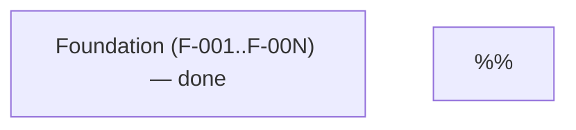

# [Project Name] — Features

> Live index of all features in the engagement.
>
> **Source-of-truth model:**
> - **This file** = human/agent-readable index. Easy to scan, link from conversation, and pick up at the start of a feature session.
> - **`tracker.yaml` `features:` block** = structured state. Drives gate logic and leadership visibility.
> - **Per-feature spec at `.forge/specs/<id>-<name>-spec.md`** = full description, requirements, acceptance criteria.
>
> These three must stay in sync. When a feature's phase or artifact status changes, update both this file and `tracker.yaml`. The PRD's §Feature Decomposition is a Gate-1-approved **snapshot** (frozen on Gate 1 approval) — do not edit it to reflect live state; reflect live state here instead.
>
> **Lifecycle:**
> - **Pre-Gate 3:** seed this file by hand from PRD §Feature Decomposition so it's useful for early planning conversations.
> - **At Gate 3:** `/forge-decompose` (full mode) regenerates this file with the agreed slicing principle, mermaid dependency graph, and final feature set; per-feature spec stubs are created at `.forge/specs/<id>-<name>-spec.md` at the same time.
> - **During delivery:** rows are updated as `Phase` advances and as `Spec` / `Plan` columns gain links.
>
> Foundation slices (`F-001`, `F-002`, …) live separately under `setup.foundation` in `tracker.yaml` — they are scaffolding, not user-visible features, and do not appear here.

## Slicing Principle

**[State the slicing principle agreed at Gate 3 — by capability / module / journey / phase.]** Each feature should own a vertical slice (UI + API + persistence + tests) for one cohesive unit. Document any rejected slicing approaches and the reason they were rejected so a future re-slicing conversation has the prior reasoning.

Source: PRD §Feature Decomposition (revision + date + approver); validated by `/forge-decompose` Gate 3 (date + run number + verdict).

<!--
## Delivery Plan

Populated by `/forge-decompose` when delivery phases are defined at Gate 3.
Optional — small projects (under ~10 features) typically skip phasing and
omit this section entirely. See framework.md §4.11.1 for the doctrine.

When populated, this section contains:

1. A short prose intro (one or two sentences naming the phasing rationale).
2. A phase table: | Phase | Title | Theme | Features |
3. A per-feature breakdown table sorted by phase: | ID | Title | Phase | Owner |

The structured equivalent lives in `tracker.yaml` `delivery.phases` and each
feature's `delivery_phase` field; this file is the human-readable mirror.
-->

## Dependency Graph

**Critical path:** [name the spine — the ordered feature sequence that gates the rest of the engagement].

**Parallel-eligible lanes:** [name features that can be worked in parallel once their upstream dependency lands].

## Features

Order rows by critical-path priority first, then breadth-first across the dependency graph.

| ID | Title | Priority | Phase | Spec | Plan | Blocked By | Notes |
|----|-------|----------|-------|------|------|------------|-------|
| 1 | [Feature title] | P0 | backlog | [spec](specs/1-feature-name-spec.md) | — | — | Short note — substrate brought, key constraints, callouts |
| 2 | [Feature title] | P0 | backlog | [spec](specs/2-feature-name-spec.md) | — | #1 | … |

## Legend

- **Phase:** `backlog` → `spec` → `plan` → `dev` → `review` → `ship` → `done`. Exit states from any phase: `paused`, `dropped`.
- **Priority:** **P0** = foundational + critical path · **P1** = core business value · **P2** = supporting / enhancement.
- **Spec / Plan columns:** link to `.forge/specs/<id>-<name>-spec.md` and `.forge/plans/<id>-<name>-plan.md`. Spec stubs are created by `/forge-decompose` full mode; plans land per-feature once each spec is approved.

## Cross-references

- **PRD §Feature Decomposition** (revision + date + approver) — origin of this list. The PRD section is frozen on Gate 1 approval; this file is the live mirror.
- **`tracker.yaml` `features:`** — structured-state mirror. Per-feature workflow steps update both this file and the YAML block in lockstep.
- **`engagement-gate-runs.md` → Gate 3** — audit of the decomposition pass (slicing principle, dependency-graph drawing, sizing audit, advisory follow-ups).

## Cross-cutting NFRs (acceptance gates, not features)

Non-functional requirements from PRD §Non-Functional Requirements that apply to **every** feature and are verified at PR-review or per-feature acceptance — list them here so spec authors reference a single canonical list rather than re-deriving them per feature. Examples:

| NFR | Source | Owner |
|---|---|---|
| [e.g. Performance budget — dashboard load < 2s] | PRD §NFR | Every dashboard feature spec — verify p95 latency in spec acceptance criteria |
| [e.g. WCAG 2.1 AA compliance] | PRD §NFR | Every UI-bearing spec — call out keyboard navigation, contrast, ARIA in acceptance criteria |
| [e.g. Audit logging] | PRD §NFR | Every feature performing audited actions writes entries to the shared audit log; verified in spec acceptance criteria |

These do not appear as rows in the feature table above because no single feature owns them. Spec authors should reference this footer when writing each feature's `## Acceptance Criteria` and `## Non-Functional Requirements` sections.
