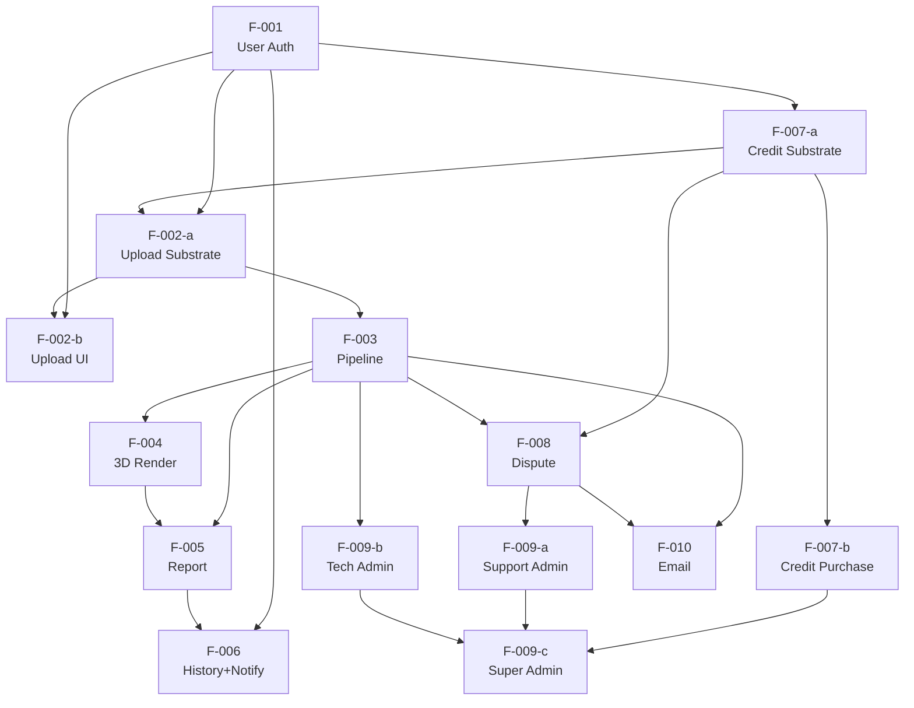

# AuctionInsightAI — Feature Index

> Generated by `/forge-decompose` on 2026-05-31. Regenerated on each Gate 3 run.
> Authoritative feature state lives in `tracker.yaml`. This file is the human-readable view.

## Slicing Principle

Features are sliced **by capability module** — each feature owns one bounded area of the product with its own backend endpoints, frontend surface (where applicable), and data entities. This aligns with the three-service architecture (Spring Boot API / Python FastAPI worker / React SPA).

FR-2 cuts applied:
- F-002 → substrate-cut: F-002-a (Upload Substrate) + F-002-b (Upload UI)
- F-007 → substrate-cut: F-007-a (Credit Substrate) + F-007-b (Credit Purchase)
- F-009 → cluster-cut: F-009-a (Support Admin) + F-009-b (Technical Admin) + F-009-c (Super Admin)

FR-4 keep-as-one (with justification):
- F-001: single authentication/session envelope
- F-003: single processing envelope in FastAPI worker
- F-005: single report delivery surface
- F-008: single dispute lifecycle state machine

## Delivery Plan

Three phases within Phase 1 of the product roadmap:

| Phase | Title | Theme |
|---|---|---|
| 1 | Core Analysis | User can upload a USS auction sheet and receive a 3D-enhanced vehicle intelligence report |
| 2 | User Operations | Users manage history, purchase credits, dispute failed analyses, receive email notifications |
| 3 | Admin Portal | Internal team can manage disputes, inspect pipeline health, and configure the platform |

| ID | Title | Phase |
|---|---|---|
| F-001 | User Authentication & Registration | 1 |
| F-002-a | Upload Substrate | 1 |
| F-002-b | Upload UI | 1 |
| F-003 | Analysis Pipeline | 1 |
| F-004 | 3D Damage Render | 1 |
| F-005 | Vehicle Intelligence Report | 1 |
| F-007-a | Credit Substrate | 1 |
| F-006 | Analysis History & Real-time Notification | 2 |
| F-007-b | Credit Purchase | 2 |
| F-008 | Credit Dispute Flow | 2 |
| F-010 | Email Notifications | 2 |
| F-009-a | Support Admin Portal | 3 |
| F-009-b | Technical Admin Portal | 3 |
| F-009-c | Super Admin Portal | 3 |

## Dependency Graph

Critical path: `F-001 → F-007-a → F-002-a → F-003 → F-004 → F-005`

## Feature Table

| ID | Title | Priority | Phase | Spec | Blocked By |
|---|---|---|---|---|---|
| F-001 | User Authentication & Registration | high | 1 | [spec](specs/f-001-user-authentication-spec.md) | — |
| F-002-a | Upload Substrate | high | 1 | [spec](specs/f-002-a-upload-substrate-spec.md) | F-001, F-007-a |
| F-002-b | Upload UI | high | 1 | [spec](specs/f-002-b-upload-ui-spec.md) | F-001, F-002-a |
| F-003 | Analysis Pipeline | high | 1 | [spec](specs/f-003-analysis-pipeline-spec.md) | F-002-a |
| F-004 | 3D Damage Render | high | 1 | [spec](specs/f-004-3d-damage-render-spec.md) | F-003 |
| F-005 | Vehicle Intelligence Report | high | 1 | [spec](specs/f-005-vehicle-intelligence-report-spec.md) | F-003, F-004 |
| F-007-a | Credit Substrate | high | 1 | [spec](specs/f-007-a-credit-substrate-spec.md) | F-001 |
| F-006 | Analysis History & Real-time Notification | medium | 2 | [spec](specs/f-006-analysis-history-notification-spec.md) | F-001, F-005 |
| F-007-b | Credit Purchase | medium | 2 | [spec](specs/f-007-b-credit-purchase-spec.md) | F-007-a |
| F-008 | Credit Dispute Flow | medium | 2 | [spec](specs/f-008-credit-dispute-flow-spec.md) | F-003, F-007-a |
| F-010 | Email Notifications | medium | 2 | [spec](specs/f-010-email-notifications-spec.md) | F-003, F-008 |
| F-009-a | Support Admin Portal | low | 3 | [spec](specs/f-009-a-support-admin-portal-spec.md) | F-008 |
| F-009-b | Technical Admin Portal | low | 3 | [spec](specs/f-009-b-technical-admin-portal-spec.md) | F-003 |
| F-009-c | Super Admin Portal | low | 3 | [spec](specs/f-009-c-super-admin-portal-spec.md) | F-007-b, F-009-a, F-009-b |

## Cross-Cutting NFRs

| Concern | Requirement | Applies To |
|---|---|---|
| Auth | All user-facing endpoints require valid JWT | All features except F-001 registration/login endpoints |
| Performance | p95 end-to-end analysis latency < 30s (aspirational — SP-ARCH-001) | F-003, F-004, F-005 |
| Observability | PipelineStep records input/output/status/confidence/timing per stage | F-003, F-004 |
| Uptime | 99.5% SLA | All features |
| Accessibility | Mobile-responsive web UI, best-effort | All React features |
