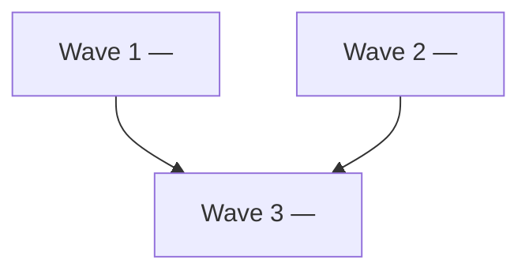
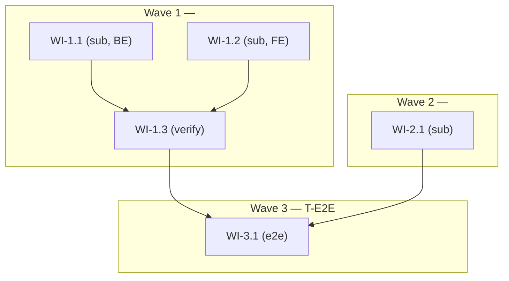

# [Feature Title] — Decomposition Plan

> Spec: `.forge/specs/<feature>-spec.md`
> Type: decomposition-plan
> Status: draft | in-review | approved
> Author:
> Reviewed by:
> Sign-off: PENDING   <!-- human reviewer: replace PENDING with your name/initials before approving. guard-plan-approval.sh blocks Status: approved while this reads PENDING -->
> Date:
> Concurrency: 3   <!-- advisory — suggests how many sub-WIs a developer can draft in parallel across fresh sessions; not enforced. Default 3. -->
> Spec branch: `feature/<SPEC_ID>-<description>`   <!-- created once before any WI implementation; all WI sessions commit here; omit if spec has no user-facing ACs -->

<!--
This file is the "plan of the decomposition" for a multi-plan feature
shipped in WAVE mode (one PR per wave to main). It is reviewed via
/forge-plan-review like any plan, but its content is deliberately thin:
it locks ONLY what must be decided at decomposition time — waves, WIs,
dependencies, AC coverage, cross-WI contract owners, test tier
assignments, AND each wave's vertical-shipping declaration.

The Decomposition Plan is NOT itself a wave or a work item — it is
the orchestrator's plan. It never ships code, has no tier, no
impl_status, no branch.

Required sections — every one must be filled before /forge-plan-review:
  ## Context
  ## Decomposition Strategy
  ## Wave Dependency Graph             <-- wave-level DAG; parallel waves explicit
  ## Workitem Dependency Graph         <-- within-wave WI structure (incl. verify-WIs)
  ## Workitem Inventory                <-- includes Success Criteria column
  ## Shared Contracts
  ## Acceptance Criterion Coverage     <-- includes Ownership column
  ## Test Strategy Map
  ## Wave Ship Plan
  ## Progress
  ## Notes (with Failed Approaches subsection)

NOT in this template (deliberately):
  - File ownership maps (defer to each sub-WI's ## Files to Modify)
  - Contract shape pinning (defer to the owning sub-WI's plan; this
    template only names the contract, the owner, and the consumers)
  - Per-WI implementation strategy (defer to each sub-WI's ## Approach)
  - Per-AC test-case detail (defer to each sub-WI's ## Test Approach)

Wave numbering: starts at 1 for the FIRST SHIPPING WAVE. There is no
"wave 1 = Key WI" convention in wave mode. The first data WI is
WI-1.1.

WI types:
  - sub     — regular data/feature WI (BE, FE, mixed)
  - verify  — integration / smoke / E2E WI within a wave that depends
              on its sibling WIs (BE-WI + FE-WI typically). Verify-WIs
              are the ONLY WI type allowed to declare depends_on
              within the same wave. Dispatched by /forge-deliver after
              all its declared sibs reach impl_status: pr-open.
  - e2e     — spec-level browser-suite WI; lives in the final wave;
              omit if spec has no user-facing ACs

Decomposition bias: aim for shippable mini-features per wave (a
vertical capability slice — DB+API+UI for one user-facing capability),
NOT a layer cake (Wave 1 schema, Wave 2 API, Wave 3 UI). Layer cuts
maximize same-wave file disjointness but compromise the wave-ship-unit
checklist's C3 (flag-or-inert) / C4 (verifiable increment) and the
project's code-quality conventions. The slicing-principle choice in
/forge-wave-decompose biases toward `capability` for this reason.
-->

## Context
<!--
One paragraph. Name the parent spec, cite the size-assessment signals
that justified multi-plan decomposition (AC count, files-to-modify
estimate, cross-repo scope, migration count, downstream consumers),
and state in one sentence what this Decomposition Plan locks for the
sub-WIs that will be drafted against it (waves, dependencies, AC
coverage, shared-contract ownership, wave ship plan).
-->

## Decomposition Strategy
<!--
The slicing principle chosen (capability | layer | repo | ac | hybrid),
why it fits this spec, and which alternatives were considered and why
rejected. One short paragraph plus a bullet list of rejected
alternatives is usually enough.

Recommended: `capability` — each wave is a vertical user-facing slice
(DB+API+UI for one capability). Layer cuts (DB → API → UI across
waves) tend to violate C3 (unfinished surfaces) or C4 (verifiable
increment); use only when the spec explicitly demands it (e.g., a pure
schema-migration feature with no user-facing surface).

Seed-data / fixture front-loading: if the feature requires seed
data, demo data, or E2E test fixtures, surface them in Wave 1's
inventory. Don't get blocked at the T-E2E wave because fixtures
weren't migrated in early.
-->

## Wave Dependency Graph

<!--
Wave-LEVEL dependency graph. Each node is a wave (not a WI). Edges
flow from a wave to a downstream wave that needs its output on main.

Waves with no incoming edges (apart from edges from waves listed in
their `Depends on waves` column) can run in PARALLEL — call them out
explicitly in the "Waves that can run in parallel" bullet below.
The orchestrator (`/forge-deliver`) reads this graph via the Wave
Ship Plan's `Depends on waves` column for next-ready selection
(default mode) and soft dep-check (--wave <N> mode).
-->

**Waves that can run in parallel:** <list of `(wave-A, wave-B)` pairs that share no upstream dep and no file overlap — e.g., `[Wave 1, Wave 2]` if both are independent vertical slices. Developer can run `/forge-deliver <TICKET> --wave 1` and `--wave 2` simultaneously in two terminals.>

## Workitem Dependency Graph

<!--
Within-wave WI-LEVEL structure. Shows the verify-WI pattern where
applicable: BE-WI + FE-WI dispatched in parallel, verify-WI dispatched
after both reach impl_status: pr-open.

Edges may flow:
  - From a lower-wave WI to a higher-wave WI (cross-wave deps OK)
  - From a sibling WI within the SAME wave to a verify-WI (within-wave
    deps allowed for type: verify, and for a `type: sub` WI ONLY when a
    same-repo compile coupling forces stacking — see the coupling note
    below)

Edges may NOT flow:
  - From a higher-wave WI to a lower-wave WI (DAG must be acyclic)
  - Within the same wave between two `type: sub` WIs that share NO
    compile coupling — those are parallel-by-construction within a wave

Within-wave coupling note (carries L-027):
  The "all `type: sub` WIs branch from `main` in parallel with empty
  within-wave depends_on" rule is sound ONLY for a CROSS-REPO (or
  cross-module / cross-language) seam, where the two sides compile
  independently and integrate over a JSON/HTTP contract. It silently
  breaks for a SAME-REPO, same-language, type-level consumer→owner
  dependency: a WI that is a compile-time consumer of a sibling WI's
  classes/types cannot reach impl_status: pr-open on a main-based
  branch (the compiling pre-commit hook blocks the commit on "cannot
  find symbol"). The cheap detector: a shared contract whose owner and
  consumer are in the SAME repo is a COMPILE coupling; cross-repo is a
  JSON SEAM. On a compile coupling, EITHER
    (a) declare a within-wave `depends_on` and STACK the consumer's
        branch on the owner's (base = owner branch, not main), OR
    (b) place owner and consumer in SEPARATE waves.
  Record the resolution in ## Shared Contracts (Coupling column) and in
  the WI's `base_branch` / `depends_on` fields. /forge-wave-decompose
  runs this detector at decompose time; this graph must reflect its
  output.
-->

## Workitem Inventory

| ID                  | Title                  | Type    | Wave | Tier   | Depends on     | Success criteria                                                | Scope summary           |
|---------------------|------------------------|---------|------|--------|----------------|-----------------------------------------------------------------|-------------------------|
| <SPEC_ID>-WI-1.1    | <title>                | sub     | 1    | T1     | —              | <one-line acceptance — "Migrations run cleanly on empty DB; tables match contract">       | <one-line scope: which functional surface this WI delivers; NO file paths> |
| <SPEC_ID>-WI-1.2    | <title>                | sub     | 1    | T2     | —              | <"API endpoints return 200 on happy path; integration tests green"> | <one-line scope>        |
| <SPEC_ID>-WI-1.3    | Verify — <wave 1 cap>  | verify  | 1    | T3     | WI-1.1, WI-1.2 | <"BE+FE integration smoke green; AC-X covered end-to-end on wave branch"> | Integration + smoke for wave 1 (BE+FE wired together) |
| <SPEC_ID>-WI-2.1    | <title>                | sub     | 2    | T3     | WI-1.3         | <one-line>      | <one-line scope>        |
| <SPEC_ID>-WI-3.1    | E2E — [Feature Title]  | e2e     | 3    | T-E2E  | WI-2.1, WI-1.3 | <"Full browser E2E suite green on wave-3 branch against main"> | Full E2E suite for this spec; no functional code |

<!--
Type values:
  sub     — regular data WI (BE, FE, or mixed) in a shipping wave;
              parallel-by-construction within a wave UNLESS a same-repo
              compile coupling forces stacking (see coupling note above)
  verify  — integration / smoke / WI-scope-E2E WI that depends on
              sibling sub-WIs in the SAME wave. Auto-proposed by
              /forge-wave-decompose when a wave contains both BE-WI
              and FE-WI. Orchestrator dispatches AFTER all its
              depends_on sibs reach impl_status: pr-open.
  e2e     — spec-level browser-suite WI; lives in the final wave
              when the spec has user-facing ACs; omit otherwise

Tier values:
  T1     — unit tests only (migrations, entities, pure data structures, config)
  T2     — unit + integration tests (services, API controllers, repositories)
  T3     — unit + integration + WI-scope browser E2E (frontend/full-stack
            WIs or verify-WIs that close user-visible ACs testable with
            prior-wave WIs already on main)
  T-E2E  — spec-level browser E2E suite; always final wave; one per spec;
            omit if spec has no user-facing ACs

Success criteria column: one-line, verifiable, agent-facing. The
orchestrator passes this verbatim to each WI's impl-agent prompt as
its `# Success Criteria` block. The agent uses it as its definition-
of-done; if the criterion isn't met, the agent halts and escalates.
Pull from the spec's AC for this WI's ownership row + the wave's
ship-state one-liner.

Scope summary is a one-line job description — "Login endpoint + audit
infra + lockout enforcement" — NOT a file list. The sub-WI's plan
session decides files, classes, methods.

If the inventory contains only 1 sub-WI: STOP. A Decomposition Plan +
1 sub-WI is structurally identical to a single-plan with decomposition
overhead. Either back out to single-plan or re-do slicing to produce
≥2 sub-WIs.
-->

## Shared Contracts

<!--
Name every cross-WI contract — anything one WI produces that another
WI consumes (API shapes, table schemas, internal-service interfaces,
env-var keys, type signatures). Owner = the WI whose plan locks the
contract's shape. Consumers = the WIs whose plans must cite the
owner's approved plan.

Coupling column (drives within-wave dispatch order; see the L-027
coupling note in ## Workitem Dependency Graph):
  - seam     — owner and consumers are in DIFFERENT repos/modules;
                integrate over a JSON/HTTP contract; parallel-from-main
                is safe; consumers branch from main
  - compile  — owner and a consumer are in the SAME repo and the
                consumer references the owner's types at compile time;
                consumer MUST stack on the owner's branch (base = owner
                branch) OR be split into a later wave

DO NOT pin shapes here. The shape is locked by the owning WI's
approved plan; consumer WIs reference that plan, not this Decomposition
Plan. If a sub-WI plan needs to change a contract's shape after its
owning WI's plan is approved, that owning plan gets a Revision entry
and this Decomposition Plan may need a Revision entry too if the
owner/consumer mapping changes.
-->

| Contract              | Owning WI          | Consumed by             | Coupling |
|-----------------------|--------------------|-------------------------|----------|
| `<contract-name>`     | `<SPEC_ID>-WI-1.1` | `<SPEC_ID>-WI-1.2`, `<SPEC_ID>-WI-1.3` | seam     |

## Acceptance Criterion Coverage

<!--
Every AC in the parent spec must map to at least one WI. The union
across rows must cover all ACs — gaps here mean ACs no sub-WI is on
the hook for, which is a Blocker-class finding in /forge-plan-review.

Ownership column (structured replacement for ad-hoc footnote markers):
  - full              — this WI owns the AC end-to-end
  - smoke             — this WI verifies the AC via a smoke check;
                          another WI owns the authoritative test
                          (e.g., a verify-WI smoke-tests an NFR that
                          a BE-WI's perf test owns authoritatively)
  - authoritative     — this WI carries the authoritative test
                          (paired with another row marked `smoke`
                          for the same AC)
  - split-across      — this AC is split across multiple WIs; the
                          row's "Owns ACs" cell uses sub-IDs
                          (AC-3.3a, AC-3.3b) and the spec carries
                          the split definitions

Use AC-ID ranges from the spec exactly (e.g., AC-L1..L9, AC-X3).
Cross-cutting ACs that every WI must satisfy (e.g., an AC requiring
the backend check command to stay green) get a dedicated row.
-->

| WI                       | Owns ACs                       | Ownership      | Notes |
|--------------------------|--------------------------------|----------------|-------|
| <SPEC_ID>-WI-1.1         | <AC-IDs or ranges>             | full           | <e.g., "DB constraints + migrations"> |
| <SPEC_ID>-WI-1.2         | <AC-IDs or ranges>             | full           | |
| <SPEC_ID>-WI-1.3         | <AC-IDs from verify scope>     | smoke          | Authoritative test owned by WI-1.1 (T1 perf bench) |
| <SPEC_ID>-WI-2.1         | <AC-IDs>                       | split-across   | Owns AC-3.3a (cf. WI-2.2 for AC-3.3b); spec defines split |
| (cross-cutting, every WI) | <e.g., AC-X5 — `<backend-check-cmd>` green in every WI's branch> | full | |

Coverage verification: <N> ACs in spec → <N> ACs mapped above (counting authoritative+smoke as one). Gaps: <none, or list>.

## Test Strategy Map

<!--
Assigns a test tier to every workitem. This is the source of truth that
/forge-plan-review checks against when reviewing each sub-WI plan. Tier
definitions are the framework-level T1/T2/T3/T-E2E model — see
.forge/test-strategy.md for the canonical tier descriptions and the
project's per-tier toolchain.

Tier values:
  T1     — unit only
  T2     — unit + integration
  T3     — unit + integration + WI-scope browser E2E (prior-wave WIs are
            already on main — no mocking of earlier waves needed)
  T-E2E  — spec-level browser E2E suite; final wave; no functional code

The T-E2E WI row covers "all ACs" because it runs the full spec suite.
Every other AC must appear in at least one non-T-E2E row — gaps are a
Blocker in /forge-plan-review.

Omit the T-E2E row (and Spec branch line) only when no AC in the spec
describes user-visible behavior. Record that decision in ## Notes.
-->

| WI ID               | Title                         | Tier   | Rationale                                                | AC IDs on hook |
|---------------------|-------------------------------|--------|----------------------------------------------------------|----------------|
| <SPEC_ID>-WI-1.1    | <title>                       | T1     | <why T1 — e.g. migrations only, no service logic>        | <AC-IDs>       |
| <SPEC_ID>-WI-1.2    | <title>                       | T2     | <why T2 — e.g. service + REST endpoints, backend-only>   | <AC-IDs>       |
| <SPEC_ID>-WI-1.3    | Verify — <wave 1>             | T3     | Wave-1 integration smoke; BE+FE wired on wave branch     | <AC-IDs (smoke)> |
| <SPEC_ID>-WI-2.1    | <title>                       | T3     | <why T3 — e.g. delivers login page; prior-wave BE on main> | <AC-IDs>     |
| <SPEC_ID>-WI-3.1    | E2E — [Feature Title]         | T-E2E  | Full browser E2E suite; runs after all functional WIs merged | all ACs    |

**Spec branch:** `feature/<SPEC_ID>-<description>`
**E2E test path:** `<frontend-repo>/<e2e-test-path>/`   <!-- project-set; see .forge/test-strategy.md -->

## Wave Ship Plan

<!--
Per-wave shipping declaration. One row per wave in the inventory
(wave 1, 2, ...; include the T-E2E wave row if present).

This section is unique to wave mode. It states, per wave:
  - Whether the wave ships independently to main (`vertical`) or as
    part of a feature-sized integration PR (`monolithic`)
  - The user-observable change on main after this wave merges
  - How to verify the wave landed correctly
  - Whether each ship-unit checklist item is satisfied (C1..C4)
  - For monolithic waves: a legitimate reason

ship_type values:
  - vertical   — wave ships to main independently; satisfies ALL four
                 checklist items below
  - monolithic — wave is part of a feature-sized shipment with a stated
                 reason

Checklist (✓/✗) — wave must satisfy all four to declare `vertical`:
  C1. Main stays green       — build / lint / existing tests stay green
                                 after this wave's PR merges
  C2. No orphan scaffolding  — no mocks/stubs introduced by a prior
                                 wave remain unused on main after this
                                 wave (consumed or removed)
  C3. Flag-or-inert          — any new user-facing surface not yet
                                 ready for users is behind a feature
                                 flag OR is internal-only / no
                                 production entry point
  C4. Verifiable increment   — wave produces an observable change on
                                 main (API / DB / UI / smoke test).
                                 Pure refactors with no behavioral
                                 delta are allowed only when the next
                                 wave's correctness depends on the
                                 refactor (call out in ## Notes)

If a wave is `monolithic`, fill `Monolithic reason` with a legitimate
justification (schema migration with no safe intermediate state,
security-sensitive refactor, irreversible data transformation).

ILLEGITIMATE reasons (plan-reviewer flags as Important):
  - "Didn't want to slice it"
  - "Easier this way"
  - "Would take longer to slice"
  - "Couldn't think of a clean cut"

`Depends on waves` column: set of upstream waves containing any WI
this wave's WIs depend on. Default `[N-1]` for purely linear features;
populate explicitly when the DAG is non-linear (fork-join across
waves). Wave 1 has empty deps.

`Verification` column: either a smoke command (a curl call, the backend
test command scoped to the touched module, the scoped E2E command) or a
pointer (`see WI-<N>.<i> plan` when a verify-WI plan owns the
verification detail). For the T-E2E wave, the whole browser E2E suite
is the verification.
-->

| Wave | Depends on waves | ship_type | Ship state on main | Verification | C1 | C2 | C3 | C4 | Monolithic reason |
|------|------------------|-----------|--------------------|--------------|----|----|----|----|-------------------|
| 1    | []               | vertical  | <one-line active voice — "users can list organizations via GET /orgs and see them in the admin sidebar"> | `see WI-1.3 plan` | ✓ | ✓ | ✓ | ✓ | — |
| 2    | [1]              | vertical  | <one-line>         | <smoke or pointer> | ✓ | ✓ | ✓ | ✓ | — |
| 3    | [2]              | vertical  | Full browser E2E suite green on main | `<e2e-cmd-scoped>` | ✓ | ✓ | ✓ | ✓ | — |

## Progress

<!--
One pair of rows per sub-WI (drafted / approved). Ticked off as the
sub-WI flow advances. Final row triggers feature.phase advance.
-->

- [ ] `<SPEC_ID>-WI-1.1` plan drafted (`Status: draft`)
- [ ] `<SPEC_ID>-WI-1.1` plan approved via `/forge-plan-review`
- [ ] `<SPEC_ID>-WI-1.2` plan drafted (`Status: draft`)
- [ ] `<SPEC_ID>-WI-1.2` plan approved via `/forge-plan-review`
- [ ] `<SPEC_ID>-WI-1.3` plan drafted (`Status: draft`)  <!-- verify-WI -->
- [ ] `<SPEC_ID>-WI-1.3` plan approved via `/forge-plan-review`
- [ ] `<SPEC_ID>-WI-2.1` plan drafted (`Status: draft`)
- [ ] `<SPEC_ID>-WI-2.1` plan approved via `/forge-plan-review`
- [ ] `<SPEC_ID>-WI-3.1` plan drafted (`Status: draft`)   <!-- T-E2E WI; omit if no user-facing ACs -->
- [ ] `<SPEC_ID>-WI-3.1` plan approved via `/forge-plan-review`
- [ ] All sub-workitem plans at `plan_status: approved` → feature advances to `phase: plan`

### Failed Approaches
<!--
Decomposition iterations that didn't work — slicing principles tried
and rejected mid-authoring, DAG shapes that produced same-wave
ownership conflicts, contracts whose ownership was reassigned mid-flow,
wave-ship declarations rejected by the ship-unit checklist that drove a
re-slicing, compile-coupling that forced a stack/split late.
Prevents the next session (or a future re-decomposition) from
repeating dead ends.
-->

## Review Checklist
<!-- Tick all items and change Sign-off in the header from PENDING to your name before approving.
     guard-plan-approval.sh blocks Status: approved while any box is unchecked or Sign-off reads PENDING. -->

- [ ] Every spec AC maps to ≥1 WI in `## Acceptance Criterion Coverage` (no orphan ACs); the count-check line is filled
- [ ] Each WI's `Success criteria` cell is present, one-line, and verifiable (the orchestrator passes it verbatim as the impl-agent's definition-of-done)
- [ ] Wave Dependency Graph + Workitem Dependency Graph are both present and acyclic; within-wave edges only flow sibling → verify-WI, or sibling → compile-coupled consumer (with a `compile` row in Shared Contracts + stacked `base_branch`)
- [ ] Each shared contract's Coupling is classified (`seam` vs `compile`); every `compile` coupling is resolved by stacking (consumer `base_branch` = owner branch) or by splitting into separate waves
- [ ] Each wave's Wave Ship Plan row is justified (C1–C4 reasoned, not boilerplate ✓); any `monolithic` wave has a legitimate reason
- [ ] Shared Contracts name owner + consumers (shapes deferred to owning WI plans); no same-wave file-collision risk flagged for review

## Notes
<!--
Review feedback, deferred decisions, cross-WI clarifications surfaced
during sub-WI authoring, pointers to upstream-plan ## Notes sections
that downstream WIs must read before drafting, rationale for any
wave declared `monolithic` beyond what fits in the Wave Ship Plan
table row.
-->
