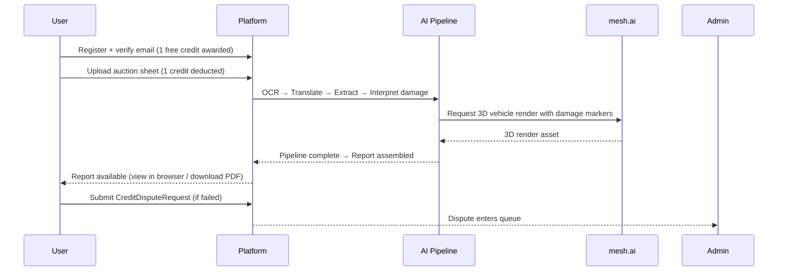

# AuctionInsightAI — Project PRD

> Status: draft
> Last updated: 2026-05-29
> Reviewed by: —

The single source-of-truth product requirements document for this engagement. Verified by `/forge-prd-check` (Gate 1) before the team commits to delivering against it.

## Gate Status

> Snapshot of engagement-readiness gates. Updated automatically by `/forge-prd-check`, `/forge-arch-probe`, `/forge-decompose` in full mode. Detailed run history lives in [`engagement-gate-runs.md`](engagement-gate-runs.md). Structured state and accepted risks/spikes live in [`tracker.yaml`](tracker.yaml) under `setup.*`.

| Gate | Status | Last Run | Risks / Spikes | Detail |
|------|--------|----------|----------------|--------|
| 1. PRD Readiness (`/forge-prd-check`) | ✅ passed | 2026-05-29 | — | [Run 2](engagement-gate-runs.md#gate-1-run-2--2026-05-29-malith3) |
| 2. Architecture & Feasibility (`/forge-arch-probe`) | ✅ passed | 2026-05-31 | — | [Run 1](engagement-gate-runs.md#gate-2-run-1--2026-05-31-malith3) |
| 3. Decomposition (`/forge-decompose`) | ✅ passed | 2026-05-31 | — | [Run 1](engagement-gate-runs.md#gate-3-run-1--2026-05-31-malith3) |

Status legend: ⏳ not-started · 🚧 in-progress · ✅ passed · ⚠️ passed-with-risks · ⚠️ passed-with-spikes · ❌ failed

## Problem Statement

Sri Lanka imports approximately 40,000–60,000 used vehicles annually,
the majority sourced from Japanese auction houses (USS, JAA, JU, TAA).
Every vehicle sold through these auctions is accompanied by a standardised
condition sheet written almost entirely in Japanese — encoding the vehicle
grade, mileage, chassis number, equipment list, damage notation, and
inspector comments using a proprietary vocabulary inaccessible to most
Sri Lankan buyers and importers.

Today, most buyers rely on a dealer or auction agent to interpret the sheet
on their behalf, with no structured record, no independent verification, and
no visibility into how the agent's summary relates to what the sheet actually
says. Self-directed importers who attempt to research independently face
generic machine-translation tools that miss auction-domain vocabulary and
damage codes, producing unreliable assessments and significant financial risk.

AuctionInsightAI solves this by accepting an uploaded auction sheet and
delivering a structured, human-readable vehicle intelligence report in
English — translating the sheet, interpreting damage codes, extracting all
canonical fields, and maintaining an analysis history that users can return
to when comparing vehicle options.

## Industry / Domain Context

The Japanese used-vehicle export market is one of the most structured in the
world. Major auction houses (USS, JAA, JU, TAA, and regional networks) operate
standardised inspection and grading protocols: a trained inspector grades each
vehicle on a numeric/alpha scale (Grade 6 → 1, RA, R), marks damage locations
on a 2D pictographic vehicle diagram using location codes (A1–F) and damage
type codes (S, D, W, C, X, XX, U, E, P, B), and writes free-text inspector
comments in Japanese.

This vocabulary is domain-specific and not captured by generic translation
tools. A Grade 3.5 vehicle with a W2 code (windscreen replacement) and U1
(undercarriage rust) carries a materially different risk profile from a 3.5
with only cosmetic scratches — a distinction that generic translation cannot
reliably surface.

Sri Lanka operates as a right-hand-drive import market. The import chain
involves Japanese auction agents who bid on behalf of Sri Lankan buyers,
shipping agents, customs brokers, and domestic dealers. Condition and price
are directly determined by the information on the auction sheet. No
purpose-built SaaS platform currently addresses auction sheet interpretation
for this market.

## Business Specifics

AuctionInsightAI is a greenfield SaaS product targeting the Sri Lankan vehicle
import market. There is no incumbent product to replace or migrate from — the
product creates a new category of tooling for a workflow currently handled by
human intermediaries or left unaddressed.

The business serves two primary customer segments:

- **Dealers and importers** who process multiple vehicles per month and need
  consistent, auditable sheet analysis to maintain quality across their team
  and share structured reports with end customers.
- **Self-directed individual buyers** who transact without a dealer and need
  independent access to auction sheet content to make informed purchase
  decisions.

The business model is pay-per-analysis (LKR 150–500 per report) with monthly
subscription tiers for higher-volume dealers (LKR 5,000–25,000/month). A
white-label portal layer enabling dealer networks to offer branded analysis
to their customers is planned for a later phase.

The product is built under the working name AuctionInsightAI. No formal
business entity is incorporated at this time.

## Scope and Boundaries

### In Scope (V1)

Phase 1 delivers the core analysis engine — the end-to-end pipeline from
auction sheet upload to structured intelligence report:

- User registration and authentication (email/password + Google OAuth)
- Auction sheet upload (PDF and image formats — JPEG, PNG, WEBP, HEIC, up to 20 MB)
- OCR extraction of Japanese and numeric text from uploaded sheets
- Japanese-to-English translation using domain-specific auction vocabulary
- Structured data extraction of all canonical fields (identity, dates,
  specifications, condition, appearance, damage notation, inspector comments)
- Damage code interpretation and plain-English explanation of damage findings
- Human-readable vehicle intelligence report generation
- Analysis history — a personal record book of past analyses per user
- Credit-based pay-per-analysis billing (LKR 150–500 per report)
- Monthly subscription tiers for dealers (LKR 5,000–25,000/month)
- 3D damage visualisation via mesh.ai rendered into the report
- Mobile-responsive web UI (no native app)
- USS auction sheet format (Phase 1); JAA, JU, TAA formats deferred to Phase 2

### Out of Scope

The following capabilities will not be built at any phase:

- Direct integration with Japanese auction house bidding systems (placing or
  managing bids on behalf of users — AuctionInsightAI is an analysis tool,
  not a bidding agent)
- Vehicle valuation or price recommendation engine (the platform interprets
  condition, not market price; pricing is outside the product's domain)
- Shipping, logistics, or import customs management (out of product domain)

### Deferred (Post-V1)

| Capability | Planned Phase | Trigger / Rationale |
|---|---|---|
| 2D damage diagram overlay on vehicle silhouette | Phase 2 | Enhanced 2D overlay; Phase 1 uses 3D mesh.ai render |
| JAA, JU, TAA auction sheet format support | Phase 2 | USS validated first in Phase 1 |
| Dealer dashboard with team access and shared history | Phase 2 | High-value dealer segment requires team features |
| API access for programmatic report generation | Phase 3 | Serves auction agents and integrators |
| White-label dealer portal with tenant branding | Phase 3 | Distribution growth vector; depends on multi-tenant infra |
| Multi-vehicle comparison and batch analysis | Phase 4 | Requires history depth and UX design; not a V1 blocker |
| Advanced risk scoring and fraud flag detection | Phase 4 | Depends on accumulated analysis data |
| Native mobile app (iOS/Android) | Phase 5 | Web-first validation before native investment |
| Global market expansion and additional language support | Phase 5 | Sri Lanka market validation required first |
| Chassis-number cross-reference (auction DB integration) | Phase 5 | Depends on auction house API access agreements |

### Phasing / Sequencing Intent

Five phases over an 18-month roadmap:

- **Phase 1 — Core Analysis Engine:** Upload → OCR → translate → extract → report → billing. Validates the AI pipeline and pays-per-analysis model.
- **Phase 2 — Enhanced Visualisation + Dealer Dashboard:** 2D damage diagram overlay, analysis history UI, dealer team dashboard.
- **Phase 3 — API + White-Label:** Programmatic API access, multi-tenant white-label dealer portals.
- **Phase 4 — Intelligence Layer:** Multi-vehicle comparison, batch processing, advanced risk scoring.
- **Phase 5 — Mobile + Global:** Native mobile app, additional language/region support, auction database integrations.

## Domain Model

### Key Entities

| Entity | Description | Key Relationships |
|--------|-------------|-------------------|
| User | A registered individual account. Owns analyses and holds a pool of individual credit records. | 1:N → Analysis; 1:N → Credit; 1:N → CreditTransaction |
| Analysis | A single auction sheet processing job — from upload through the extraction pipeline to a completed report. The central unit of the product. Owned by exactly one User; shareable via a public link. | N:1 → User; 1:N → PipelineStep; 1:1 → Report; 1:1 → Credit (consumed on initiation); 1:1 → CreditDisputeRequest (optional) |
| PipelineStep | An individual stage in the extraction pipeline (OCR, Translation, Extraction, Report Generation). Records input, output, status, confidence scores, and timing for that stage. | N:1 → Analysis |
| Report | The structured output document produced at the end of a successful Analysis. Carries a visibility setting (private / public link) enabling shareable access. | 1:1 → Analysis |
| Credit | A distinct billing-unit record. Each purchased credit is its own row; consumed when assigned to an Analysis. Status: available → consumed (or refunded). | N:1 → User; 1:1 → Analysis (when consumed) |
| CreditTransaction | A ledger entry on the User's account recording every balance movement — purchase (+N credits), consumption (−1, with analysis reference), or admin adjustment. Not tied to a specific Credit record; provides the running account statement. | N:1 → User; N:1 → Analysis (optional, for consumption events) |
| CreditDisputeRequest | A user-submitted refund request against a specific failed Analysis. Maximum one dispute per Analysis. Resolved by Support Admin (approve → credit restored; decline → recorded). | 1:1 → Analysis |

### Lifecycle States

**Analysis:**
```
uploaded → ocr_processing → translation_processing → extraction_processing
        → report_generating → completed
                            → failed (any step)
                            → needs_review (low-confidence fields flagged)
                            → intervention (Technical/Super Admin correcting a step)
        intervention → [resumes from corrected step] → ... → completed
```

A failed Analysis retains its PipelineStep records so Technical Admin and
Super Admin can inspect exactly which step failed and why. If the failure
is due to correctable input data (e.g., bad OCR output), Technical Admin
or Super Admin may edit the PipelineStep output and resume the pipeline
from the next step. Users may submit a CreditDisputeRequest against a
failed Analysis; Support Admin can approve (credit restored) or decline.

**CreditDisputeRequest:**
```
submitted → under_review → approved (credit restored)
                        → declined
```

### Glossary

| Term | Meaning |
|------|---------|
| Auction Sheet | Standardised vehicle condition document issued by a Japanese auction house for every vehicle sold |
| Grade | Overall vehicle condition rating assigned by the auction house inspector. Scale: 6, 5, 4.5, 4, 3.5, 3, 2, 1, RA, R (6 = best) |
| Damage Code | Alphanumeric code encoding damage location (A1–F) and damage type (S, D, W, C, X, XX, U, E, P, B) on the auction sheet diagram |
| Inspector Notes | Free-text comments written in Japanese by the auction house inspector describing vehicle condition |
| Lot Number | The auction house's identifier for a vehicle in a specific sale event |
| Chassis / VIN | Vehicle Identification Number — unique to the vehicle; used to cross-reference auction data |
| Credit | A billing unit. One credit entitles the user to one Analysis |
| Analysis | A single end-to-end processing job: one uploaded auction sheet through the pipeline to a completed Report |
| Pipeline | The ordered sequence of processing stages: OCR → Translation → Extraction → Report Generation |
| OCR | Optical Character Recognition — extracts printed/handwritten text from the uploaded image/PDF |

## Users and Access

### Roles

| Role | Description | Primary Capabilities |
|------|-------------|----------------------|
| Individual User | A registered account holder. The primary end-user of the product. | See CRUD matrix below |
| Support Admin | Internal operations staff handling user issues and billing disputes. | See CRUD matrix below |
| Technical Admin | Internal engineering/ops staff responsible for pipeline health. | See CRUD matrix below |
| Super Admin | Full platform authority — highest privilege level. | See CRUD matrix below |

### Per-Role × Per-Resource Capability Matrix

| Resource | Individual User | Support Admin | Technical Admin | Super Admin |
|---|---|---|---|---|
| **Analysis** | Create (upload own); Read (own only) | Read (all users) | Read (all users) | Read (all users) |
| **Report** | Read (own only); Update visibility (public/private); Download PDF | Read (all users) | Read (all users) | Read (all users) |
| **PipelineStep** | — | — | Read all (inputs, outputs, logs, confidence scores); Update (correct step output data); Resume pipeline from any step | Read all; Update (correct step output data); Resume pipeline from any step |
| **Credit** | Read (own balance); Purchase | Read (all users); Update (manual adjustment / refund) | — | Read (all); Update (manual adjustment / refund) |
| **CreditDisputeRequest** | Create (on own failed Analysis, max 1 per Analysis); Read (own only) | Read (all); Update (approve / decline) | Read (all, read-only for root cause) | Read (all); Update (approve / decline) |
| **User** | Create (register); Read (own profile); Update (own profile); Delete (own account) | Read (all users) | — | Read (all); Delete / deactivate any account |
| **AdminAccount** | — | — | — | Create; Read (all); Update; Delete / deactivate |
| **BillingConfig** | — | — | — | Create; Read; Update (credit packages, pricing) |

### Multi-Tenancy / Org Hierarchy

Not applicable in Phase 1. Every user is an individual account with no
organisational hierarchy or shared credit pools. Multi-tenant dealer
organisations are introduced in Phase 2.

## Functional Surface

### User Registration and Authentication

Users register via email/password or Google OAuth 2.0. Email verification
is required before the first analysis can be run. Password reset is
available via email OTP. On successful registration, the user is credited
with 1 free analysis credit. JWT-based sessions with 24-hour access tokens
and 30-day refresh tokens.

### Auction Sheet Upload

Users upload a single auction sheet as a PDF or image file (JPEG, PNG,
WEBP, HEIC) up to 20 MB. The system validates file type via MIME sniffing
(not extension), displays a thumbnail preview and upload progress indicator,
and stores the original file in AWS S3 with AES-256 server-side encryption.
One credit is deducted from the user's balance on upload initiation. Re-upload
is permitted if the sheet is rejected as poor quality.

Phase 1 supports USS (USS Auction) format sheets only. Support for JAA, JU,
and TAA formats is deferred to Phase 2.

### Analysis Pipeline

The pipeline runs five sequential stages; each stage is recorded as a
PipelineStep with input, output, status, confidence scores, and timing:

1. **OCR Extraction** — PaddleOCR extracts all Japanese and numeric text
   from the uploaded image/PDF. Handles skewed or rotated images (auto-deskew
   up to ±15°). Per-field confidence scores (0.0–1.0) are assigned; fields
   below 0.75 confidence are flagged for review.

2. **Translation** — Extracted Japanese text is translated to English using a
   domain-tuned large language model (LLM provider TBD — candidates include
   OpenAI GPT-4o, Google Vertex AI models, and equivalents) with domain-specific
   system prompts and a curated glossary of 500+ auction-domain terms. Ambiguous
   translations are flagged with an alternative interpretation.

3. **Structured Extraction** — All canonical fields are extracted and mapped:
   identity (lot number, chassis/VIN, model code/name), dates (registration,
   manufacture, inspection), specifications (displacement, transmission, drive
   type, doors, fuel type, seat capacity), condition (grade, interior grade,
   mileage), appearance (colour, changed colour), dimensions, and assessment
   (good points, bad points, inspector comments).

4. **Damage Interpretation** — All damage codes on the sheet diagram are
   parsed. Location codes (A1–F) and damage type codes (S, D, W, C, X, XX,
   U, E, P, B) are mapped to plain-English descriptions and severity
   assessments.

5. **Report Generation** — A structured vehicle intelligence report is
   compiled from all extracted and interpreted data (see Report section below).

An Analysis that fails at any stage retains all PipelineStep records for
admin inspection. The credit consumed is not automatically restored on
failure; users may submit a CreditDisputeRequest.

### Vehicle Intelligence Report

The generated report contains:

- **Vehicle Summary** — Structured specs table (identity, dates, condition,
  specifications, dimensions)
- **Translated Inspector Notes** — Full translation of free-text inspector
  comments with flagged ambiguities
- **3D Damage Visualisation** — A 3D rendered vehicle model provided by
  mesh.ai with damage markers overlaid at the locations indicated on the
  auction sheet diagram, colour-coded by damage type and severity
- **Damage Detail Table** — Every damage code expanded into location,
  type, and plain-English description
- **Equipment List** — Decoded optional equipment and features
- **Buyer Summary** — AI-generated plain-English summary with: Critical
  Issues, Genuine Strengths, and Recommended Next Steps

The report is viewable in-browser and downloadable as a formatted PDF.

### Analysis History

Every completed (and failed) Analysis is stored against the user's account
as a persistent record. Users can browse their history, re-open any past
report, and use it as a reference when comparing vehicle options. History
is retained indefinitely while the account is active.

### Credit Management

Users purchase credits through the platform (payment gateway TBD —
PayHere and/or Stripe). Credit packages and pricing are configurable by Super
Admin. New users receive 1 free credit on account registration. All credit
movements (purchase, consumption, admin adjustment) are recorded in
CreditTransaction audit records visible to the user and to admins.

### Credit Dispute Flow

A user whose Analysis failed may submit a CreditDisputeRequest through the
platform. The request enters a Support Admin queue. Support Admin reviews
the failure context and either approves (credit is restored to the user's
balance) or declines the request. The decision and reason are recorded.
Technical Admin can independently inspect the PipelineStep logs for the
same Analysis to determine root cause.

### Admin Portal

The platform includes an internal admin portal accessible to internal staff:

- **Support Admin view:** Credit dispute queue; user search and credit
  balance management; analysis history across all users.
- **Technical Admin view:** Pipeline step inspection for any Analysis (raw
  inputs, outputs, confidence scores, error logs); failed and flagged analysis
  queue; system processing metrics.
- **Super Admin view:** All of the above; billing and pricing configuration;
  credit package management; internal admin account management; platform-wide
  audit logs.

### User Journeys



### Integration Points

| System | Direction | Purpose |
|--------|-----------|---------|
| LLM Provider (TBD) | Outbound | Japanese-to-English translation and structured field extraction. Candidates: OpenAI GPT-4o, Google Vertex AI models, and equivalents. Final selection deferred to architecture phase. |
| PaddleOCR | Internal | Text extraction from uploaded images/PDFs |
| mesh.ai | Outbound | 3D vehicle render with damage overlay for Phase 1 reports. Alternative 3D render providers will be evaluated in future phases. |
| AWS S3 | Outbound | Encrypted storage of original uploaded sheets |
| Google OAuth 2.0 | Inbound | Social login for user registration/authentication |
| Payment Gateway (TBD) | Outbound | Credit purchase processing (PayHere and/or Stripe) |
| Email Provider (TBD) | Outbound | Pipeline completion and failure notifications when WebSocket session has expired (AWS SES or SendGrid) |

## Non-Functional Requirements

### Performance

- End-to-end analysis latency (upload to report available): p95 < 30 seconds
- OCR extraction: < 10 seconds
- Report generation uptime SLA: 99.5%
- Concurrent user load: sized for early-market volumes; architecture must
  scale horizontally to support 3,000+ analyses per month at launch

### Security and Compliance

- All uploaded files stored in AWS S3 with AES-256 server-side encryption
- JWT tokens signed RS256; 24-hour access token expiry, 30-day refresh token
- Failed login attempts rate-limited (5 per 10 minutes per IP)
- No specific data residency requirement in Phase 1; AWS region selection
  deferred to architecture phase
- Uploaded auction sheets and generated reports retained indefinitely while
  the account is active; a formal data retention policy is deferred

### Accessibility

Best-effort in Phase 1. No formal WCAG compliance commitment. Mobile-responsive
web UI is required; assistive-tech compatibility is a future concern.

### Observability and Audit

- Every PipelineStep records input, output, status, confidence scores, and
  timing — surfaced to Technical Admin
- Every credit movement recorded in CreditTransaction audit log
- Credit dispute decisions (approve/decline) recorded with reason
- Platform-wide audit logs accessible to Super Admin

## Constraints

### Tech Stack

| Layer | Technology | Status |
|---|---|---|
| Backend API | Java Spring Boot | Mandatory |
| AI microservices | Python FastAPI | Mandatory |
| Frontend | React | Mandatory |
| Cloud infrastructure | AWS | Mandatory |
| OCR engine | PaddleOCR | Mandatory |
| 3D render provider | mesh.ai | Mandatory (Phase 1) |
| LLM provider | TBD (OpenAI GPT-4o / Google Vertex AI / equivalent) | Open — architecture phase |
| Payment gateway | TBD (PayHere / Stripe) | Open — architecture phase |

### Regulatory

No specific regulatory regime applies to Phase 1 (no health data, no
financial services licence required for credit-based billing in Sri Lanka
at this scale). Standard data protection best practices apply.

### Deployment and Hosting

AWS-hosted. No on-premise or hybrid deployment requirement. Region
selection to be confirmed during architecture phase.

## Input Sources

| Source | Date / Version | Used For |
|--------|----------------|----------|
| AuctionInsightAI SRS v1.0.0 | May 2026 | Functional requirements, tech stack, business model, user personas, DB schema, API contracts |
| USS auction sheet example (annotated PNG) | May 2026 | Understanding sheet layout, field positions, damage diagram structure |
| Auction sheet domain guide PDFs (auction-sheet-guide.pdf, drift-and-drive-auction-sheet-decoded.pdf) | May 2026 | Damage code vocabulary, grading system, inspection notation |
| JP Sheet competitor screenshots (35 screenshots) | May 2026 | Competitive analysis; target output shape for vehicle intelligence reports |
| forge-prd-author interview | 2026-05-29 | Scope decisions, phasing, roles, domain model, NFRs, success criteria |

## Risks

<!-- Known unknowns that may bite us during implementation. Owner + status per row.
     OPEN QUESTIONS DO NOT LIVE HERE — see project-prd-signals.md (sidecar file).
     A path-scoped rule (.claude/rules/prd.md) and a PreToolUse hook
     (guard-prd-shape.sh) enforce the split; trying to add an OQ row to this
     file will be blocked. -->

| # | Item | Owner | Status |
|---|------|-------|--------|
| R-1 | LLM translation accuracy on rare auction vocabulary — domain-specific terms not in training data may be mistranslated, producing incorrect report fields | Engineering | Open |
| R-2 | mesh.ai API reliability and SLA — if mesh.ai is unavailable, the 3D visualisation step fails, blocking report completion | Engineering | Open |
| R-3 | OCR quality on low-resolution or heavily annotated sheets — handwritten damage markers may be missed or misread, producing incomplete damage interpretation | Engineering | Open |
| R-4 | Payment gateway selection delays — TBD status may delay billing feature completion if provider onboarding takes longer than expected | Product | Open |
| R-5 | USS sheet format variation — USS sheets have minor layout variations by region/year; Phase 1 extraction may need format-specific handling not anticipated until real sheets are processed | Engineering | Open |

## Success Criteria

The following metrics define successful delivery of the Phase 1 product
(12-month targets from launch):

| Metric | Target |
|---|---|
| Analyses processed per month | 3,000+ |
| Report generation latency (p95) | < 35 seconds |
| Field extraction accuracy | > 92% |
| Paying dealer tenants (subscriptions) | 20+ |
| Monthly Recurring Revenue | LKR 500,000+ |
| User satisfaction (CSAT) | > 4.2 / 5.0 |
| Platform uptime SLA | 99.5% |

## Sidecar Files

This PRD is the **live contract** — the frozen-at-Gate-1 statement of what we are building. Two sidecar files carry the content classes that change post-Gate-1 or are pure bookkeeping:

| File | Contents | Lifecycle |
|------|----------|-----------|
| [`project-prd-signals.md`](project-prd-signals.md) | Live signals — open and partial open questions, anchored to PRD sections and (optionally) to features that they block. | Authored as questions surface (interview, gates, mid-engagement). Resolved by folding the answer into this PRD body and moving the row to `project-prd-history.md`. |
| [`project-prd-history.md`](project-prd-history.md) | Audit trail — resolved open questions and PRD revisions. | Append-only. |

The OQ resolution procedure and shape-enforcement rules live in [`.claude/rules/prd.md`](../.claude/rules/prd.md) (path-scoped — loads when any `project-prd*.md` file is read or edited).
